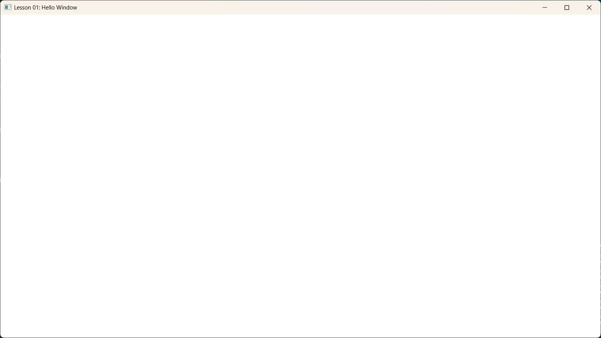

# Lesson 01: Hello Window



## Goal (目标)
本课的目标非常简单：创建一个标准的 Windows 窗口。
在 DirectX 12 能够绘制任何像素之前，我们需要一个操作系统层面的窗口句柄 (`HWND`) 来承载我们的渲染内容。

## Content (核心内容)
Windows 图形编程的基础是 Win32 API。虽然现在有很多封装库（如 GLFW, SDL），但理解底层的窗口创建过程对于排查问题非常有帮助。

本课主要包含以下三个步骤：
1.  **注册窗口类 (Register Window Class)**: 告诉操作系统我们的窗口长什么样（图标、光标、处理函数等）。
2.  **创建窗口 (Create Window)**: 实例化一个窗口对象。
3.  **消息循环 (Message Loop)**: 保持程序运行并响应用户的输入（点击、键盘、调整大小）。

## Detailed Code Explanation (代码详解)

### 1. WindowProc (窗口过程函数)
这是窗口的“大脑”。每当有事情发生（用户点了关闭按钮、按了键盘），操作系统就会调用这个函数。
```cpp
LRESULT CALLBACK WindowProc(HWND hwnd, UINT uMsg, WPARAM wParam, LPARAM lParam) {
    switch (uMsg) {
    case WM_DESTROY:
        // 当窗口被销毁时，发送退出消息，结束消息循环
        PostQuitMessage(0);
        return 0;
    }
    // 对于我们不关心的消息，通过 DefWindowProc 交给系统默认处理
    return DefWindowProc(hwnd, uMsg, wParam, lParam);
}
```

### 2. Main Entry & Registration (入口与注册)
```cpp
int WINAPI WinMain(...) {
    // 1. 定义窗口属性
    const wchar_t* CLASS_NAME = L"VibeDX12Window";
    WNDCLASS wc = {};
    wc.lpfnWndProc = WindowProc; // 绑定处理函数
    wc.hInstance = hInstance;    // 当前应用程序实例句柄
    wc.lpszClassName = CLASS_NAME; // 给这一类窗口起个名字
    
    // 向系统注册。如果不注册，后续无法根据 CLASS_NAME 创建窗口
    RegisterClass(&wc);
```

### 3. Create Window (创建窗口)
```cpp
    // 2. 创建窗口实例
    HWND hwnd = CreateWindowEx(
        0, 
        CLASS_NAME,                 // 使用刚才注册的类名
        L"Lesson 01: Hello Window", // 标题栏显示的文字
        WS_OVERLAPPEDWINDOW,        // 标准窗口样式 (带标题栏、最大化最小化按钮)
        CW_USEDEFAULT, CW_USEDEFAULT, CLIENT_WIDTH, CLIENT_HEIGHT, // 位置和大小
        NULL, NULL, hInstance, NULL
    );

    if (hwnd == NULL) return 0; // 创建失败保护

    ShowWindow(hwnd, nCmdShow); // 显示出来！
```

### 4. Message Loop (消息泵)
如果没有这个循环，程序初始化完就会立刻退出。我们需要不断地从系统队列里“泵”出消息。
```cpp
    MSG msg = {};
    // GetMessage 会阻塞程序直到有消息到来
    // 如果收到 WM_QUIT (由 PostQuitMessage 发送)，GetMessage 返回 false，循环结束
    while (GetMessage(&msg, NULL, 0, 0)) {
        TranslateMessage(&msg); // 翻译键盘消息 (如将按键转换成字符)
        DispatchMessage(&msg);  // 将消息分发给 WindowProc 处理
    }
```
**注意**: 在后续的游戏循环中，我们会把 `GetMessage` 换成 `PeekMessage`，因为我们希望在没有消息时也能全速渲染画面，而不是阻塞等待。
