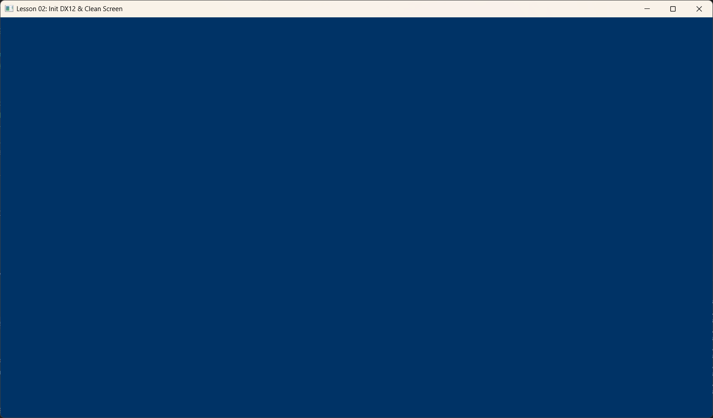

# Lesson 02: Init DX12 (初始化 DirectX 12)



## Goal (目标)
本课的目标是“点亮”显卡。我们要初始化 Direct3D 12 的核心组件，并建立起 CPU 与 GPU 之间的沟通桥梁。
最终效果虽然只是一个纯色的窗口，但这标志着你的显卡已经准备好接收绘图指令了。

## Content (核心内容)
初始化 DX12 就像组装一台电脑，你需要准备好各个部件：
1.  **Factory (工厂)**: 用来创建其它对象（如交换链）。
2.  **Device (设备)**: 代表你的显卡（虚拟显卡）。
3.  **Command Queue (命令队列)**: GPU 的任务列表，CPU 往里面扔命令，GPU 负责执行。
4.  **Swap Chain (交换链)**: 管理屏幕显示的“画板”（双重缓冲）。
5.  **Descriptor Heap (描述符堆)**: 存放资源的“身份证”。

## Detailed Code Explanation (代码详解)

### 1. Create Device (创建设备)
这是起步的第一步。Device 是所有 DX12 资源的创建者。
```cpp
void InitDX12App::InitDX12() {
    // 1. 创建 DXGI Factory (图形基础设施)
    ThrowIfFailed(CreateDXGIFactory1(IID_PPV_ARGS(&m_dxgiFactory)));

    // 2. 尝试创建物理硬件设备 (Hardware Device)
    HRESULT hardwareResult = D3D12CreateDevice(
        nullptr,             // 使用默认显卡 (通常是独显)
        D3D_FEATURE_LEVEL_11_0, // 最低支持的功能级别
        IID_PPV_ARGS(&m_d3dDevice)
    );

    // 如果没有独显或者驱动有问题，回退到 WARP (Windows Advanced Rasterization Platform)
    // WARP 是微软提供的高性能软件光栅化器 (CPU 模拟 GPU)
    if (FAILED(hardwareResult)) {
        // ... Log warning ...
        m_dxgiFactory->EnumWarpAdapter(IID_PPV_ARGS(&pWarpAdapter));
        D3D12CreateDevice(pWarpAdapter.Get(), ...);
    }
}
```

### 2. Command Objects (命令对象)
CPU 和 GPU 是并行工作的。CPU 不会直接告诉 GPU "画这个点"，而是把一堆命令记录到列表里，然后扔给队列。
```cpp
void InitDX12App::InitCommandObjects() {
    // 1. 命令队列 (Command Queue): 它是 GPU 的收件箱
    D3D12_COMMAND_QUEUE_DESC queueDesc = {};
    queueDesc.Type = D3D12_COMMAND_LIST_TYPE_DIRECT; // 直接命令队列 (通用)
    m_d3dDevice->CreateCommandQueue(&queueDesc, IID_PPV_ARGS(&m_commandQueue));

    // 2. 命令分配器 (Command Allocator): 这是命令列表的内存池
    // 当我们 Reset 命令列表时，实际上是在复用分配器里的内存
    m_d3dDevice->CreateCommandAllocator(D3D12_COMMAND_LIST_TYPE_DIRECT, IID_PPV_ARGS(&m_commandAllocator));

    // 3. 命令列表 (Command List): 我们在这里面录制 "DrawCall"
    m_d3dDevice->CreateCommandList(
        0,
        D3D12_COMMAND_LIST_TYPE_DIRECT,
        m_commandAllocator.Get(), 
        nullptr, 
        IID_PPV_ARGS(&m_commandList));

    // 初始状态先关闭，等待后续使用
    m_commandList->Close();
}
```

### 3. Swap Chain (交换链)
为了防止画面撕裂 (Tearing)，我们需要至少两张图（前台缓冲区和后台缓冲区）轮替显示。
```cpp
void InitDX12App::InitSwapChain() {
    DXGI_SWAP_CHAIN_DESC sd;
    sd.BufferCount = 2; // 双重缓冲 (Double Buffering)
    sd.BufferDesc.Format = DXGI_FORMAT_R8G8B8A8_UNORM; // 32位颜色 (RGBA 各8位)
    sd.BufferUsage = DXGI_USAGE_RENDER_TARGET_OUTPUT; // 我们要往这里面画图
    sd.OutputWindow = m_hMainWnd; // 绑定到我们的窗口
    sd.SwapEffect = DXGI_SWAP_EFFECT_FLIP_DISCARD; // 现代 Windows 推荐模式
    sd.SampleDesc.Count = 1; // 不使用多重采样 (MSAA)

    // 创建交换链
    // 注意：Swap Chain 需要知道要把画面呈现通过哪个队列送出去
    m_dxgiFactory->CreateSwapChain(
        m_commandQueue.Get(),
        &sd,
        &m_swapChain
    );
}
```

### 4. Descriptor Heap & RTV (渲染目标视图)
资源 (Resource) 只是显存里的一坨数据。GPU 要想使用它，需要一个“描述符 (Descriptor)”来说明这坨数据是什么（是颜色？是深度？还是纹理？）。
RTV (Render Target View) 就是告诉 GPU：这块内存可以当作画布。

```cpp
void InitDX12App::InitRtvAndDsvDescriptorHeaps() {
    // 1. 创建 RTV 堆 (存放 RTV 描述符的地方)
    D3D12_DESCRIPTOR_HEAP_DESC rtvHeapDesc;
    rtvHeapDesc.NumDescriptors = SwapChainBufferCount; // 我们有 2 个缓冲区，所以需要 2 个描述符
    rtvHeapDesc.Type = D3D12_DESCRIPTOR_HEAP_TYPE_RTV;
    m_d3dDevice->CreateDescriptorHeap(&rtvHeapDesc, IID_PPV_ARGS(&m_rtvHeap));

    // 2. 为交换链中的每一个 Buffer 创建 RTV
    // 这是一个循环：获取 Buffer -> 创建 View -> 指针移到下一个插槽
    CD3DX12_CPU_DESCRIPTOR_HANDLE rtvHeapHandle(m_rtvHeap->GetCPUDescriptorHandleForHeapStart());
    
    for (UINT i = 0; i < SwapChainBufferCount; i++) {
        // 从 SwapChain 获取第 i 个 Buffer 资源
        m_swapChain->GetBuffer(i, IID_PPV_ARGS(&m_swapChainBuffers[i]));
        
        // 在堆上创建描述符
        m_d3dDevice->CreateRenderTargetView(m_swapChainBuffers[i].Get(), nullptr, rtvHeapHandle);

        // 指针偏移 (类似于 C++ 指针 + 1，但需要知道结构体的大小)
        rtvHeapHandle.Offset(1, m_rtvDescriptorSize);
    }
}
```

### 5. Render Loop (渲染循环)
每一帧的绘制过程是一个固定的“仪式”：
1.  **Reset**: 准备好记录新的命令。
2.  **Barrier (Present -> RT)**: 告诉驱动，“我要开始往这张图上画画了，请把它准备好”。
3.  **Clear**: 用单一颜色刷满屏幕（清屏）。
4.  **Barrier (RT -> Present)**: “我画完了，请把它拿去显示吧”。
5.  **Execute**: 提交任务单给 GPU。
6.  **Present**: 交换缓冲区，显示新画面。
7.  **Sync (Flush)**: 等待 GPU 画完。

```cpp
void InitDX12App::OnRender() {
    // 1. 复用内存
    m_commandAllocator->Reset();
    m_commandList->Reset(m_commandAllocator.Get(), nullptr);

    // 2. 状态切换：从“显示状态”切到“渲染目标状态”
    // D3D12 中必须手动管理资源状态，防止 GPU 在你写入的同时读取它
    auto barrier = CD3DX12_RESOURCE_BARRIER::Transition(
        m_swapChainBuffers[m_currBackBuffer].Get(),
        D3D12_RESOURCE_STATE_PRESENT,
        D3D12_RESOURCE_STATE_RENDER_TARGET);
    m_commandList->ResourceBarrier(1, &barrier);

    // 3. 设置视口 (哪里可以画)
    m_commandList->RSSetViewports(1, &m_screenViewport);
    m_commandList->RSSetScissorRects(1, &m_scissorRect);

    // 4. 清除屏幕 (蓝色背景)
    // 获取当前后台缓冲区的 RTV 句柄
    CD3DX12_CPU_DESCRIPTOR_HANDLE rtvHandle(
        m_rtvHeap->GetCPUDescriptorHandleForHeapStart(),
        m_currBackBuffer,
        m_rtvDescriptorSize);
        
    m_commandList->ClearRenderTargetView(rtvHandle, Colors::LightSteelBlue, 0, nullptr);

    // 5. 状态切换：切回“显示状态”
    auto barrierBack = CD3DX12_RESOURCE_BARRIER::Transition(..., D3D12_RESOURCE_STATE_RENDER_TARGET, D3D12_RESOURCE_STATE_PRESENT);
    m_commandList->ResourceBarrier(1, &barrierBack);

    // 6. 提交
    m_commandList->Close();
    ID3D12CommandList* cmdsLists[] = { m_commandList.Get() };
    m_commandQueue->ExecuteCommandLists(1, cmdsLists);

    // 7. 呈现 (Present)
    m_swapChain->Present(1, 0);

    // 8. 简单的 CPU-GPU 同步 (Flush)
    // 我们在这个例子中简单粗暴地等待 GPU 完成所有工作，
    // 实际游戏中通常会使用 Frame Resources 来允许 CPU 领先 GPU 1-2 帧。
    FlushCommandQueue(); 
}
```

### 6. Synchronization (同步)
在 DirectX 12 中，**CPU 和 GPU 是完全并行的**。
* CPU 提交了一堆命令（Draw, Clear...）给 GPU 的队列，然后 CPU **立刻**继续往下跑。
* 如果 CPU 跑得太快，可能会在 GPU 还没读完数据时就覆盖了内存（比如 `Reset` 了分配器），导致崩溃。

为了防止这种情况，我们需要 **Fence (围栏)**。

```cpp
// 1. 在命令队列中打入一个标记 (Signal)
m_currentFence++;
m_commandQueue->Signal(m_fence.Get(), m_currentFence);

// 2. 检查 GPU 是否已经执行到了这个标记
if (m_fence->GetCompletedValue() < m_currentFence) {
    // 3. 如果没执行到，CPU 睡觉等待 (Wait)
    HANDLE eventHandle = CreateEventEx(nullptr, nullptr, false, EVENT_ALL_ACCESS);
    m_fence->SetEventOnCompletion(m_currentFence, eventHandle);
    WaitForSingleObject(eventHandle, INFINITE);
    CloseHandle(eventHandle);
}
```

> **注意**: 这是一个简单的“CPU 等 GPU”的同步方式，效率较低。在后续的高级课程中，我们会学习如何让 CPU 提前准备下一帧的数据（Frame Resources），实现 CPU 和 GPU 的“流水线作业”。

---
### 总结
初始化 DX12 就像组装一台主机：
1. **Factory**: 显卡工厂。
2. **Device**: 具体的显卡。
3. **Command Queue**: 发号施令的对讲机。
4. **Swap Chain**: 双重缓冲的画布。
5. **Descriptor Heap**: 资源身份证的卡包。

恭喜！通过前两节课，我们已经完成了看似繁琐但基础最牢固的搭建工作。接下来，我们将正式开始图形绘制的学习！
