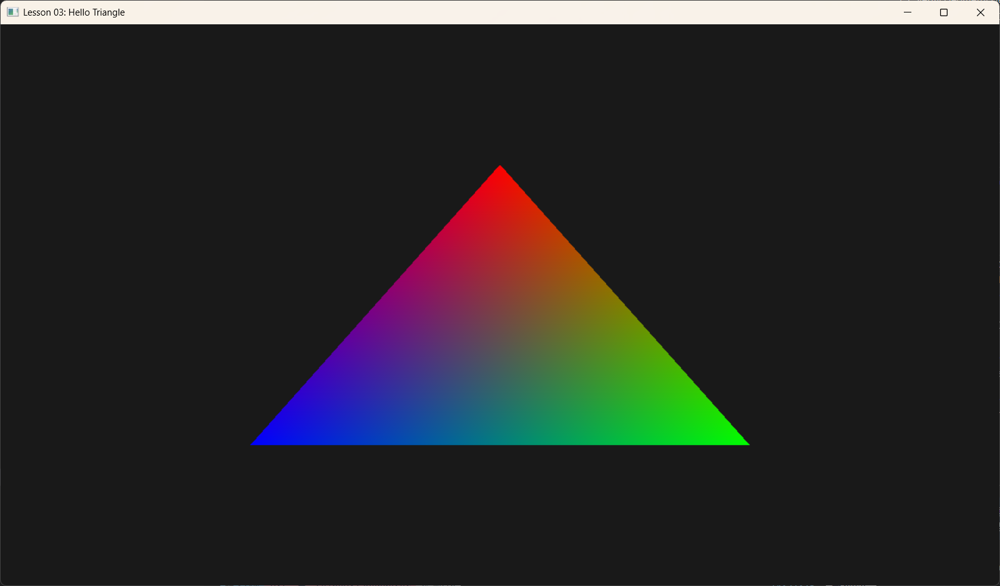

# Lesson 03: Hello Triangle (你好，三角形)



## 1. Introduction (引言)
在上一节课中，我们学会了如何初始化 DirectX 12 并清除屏幕（把它刷成蓝色）。虽然这证明了显卡在工作，但我们的屏幕依然是一片虚无。
本节课的目标是渲染计算机图形学中最基本的图元——**三角形**。

不要小看这个三角形，为了画出它，我们需要打通整条 **渲染管线 (Graphics Pipeline)**。这就像为了点亮第一个灯泡，我们需要先铺设好整栋大楼的电路。

## 2. The Concepts (核心概念)
渲染管线就像一个工厂流水线，数据（顶点）从一端进去，像素（图像）从另一端出来。在 DX12 中，我们需要配置这条流水线的每一个环节：

1.  **Input Assembler (IA)**: “原材料进料口”。负责把内存里的顶点数据读取出来，组装成几何形状（三角形）。
2.  **Vertex Shader (VS)**: “造型师”。处理每一个顶点，确定它们在屏幕上的位置。
3.  **Rasterizer (RS)**: “扫描仪”。把三个顶点围成的三角形，“像素化”成屏幕上的一个个方格。
4.  **Pixel Shader (PS)**: “涂色师”。决定每个像素最终显示什么颜色。
5.  **Output Merger (OM)**: “装箱员”。把最终颜色写入后台缓冲区，准备显示。

为了让这条流水线跑起来，我们需要几个关键组件：
*   **Vertex Data**: 告诉 GPU 三角形的三个角在哪里，是什么颜色。
*   **Shaders (HLSL)**: 告诉 GPU 怎么处理这些顶点和像素。
*   **Root Signature**: 类似于函数的定义头，告诉 Shader 数据“长什么样”。
*   **PSO (Pipeline State Object)**: 把上面所有配置（Shader、混合模式、深度测试等）打包成一个不可修改的“状态对象”。

---

## 3. Code Implementation (代码实现)

### 3.1 Shaders (着色器脚本)
我们首先需要编写一段简单的 HLSL (High-Level Shader Language) 代码，保存在 `shaders.hlsl` 中。
DX12 的管线是**可编程**的，这意味着我们必须写代码告诉显卡如何处理顶点和像素。

```hlsl
// 结构体定义：对应 C++ 端的 Vertex 结构
struct VertexIn
{
    float3 PosL  : POSITION; // 输入位置 (Local Space)
    float4 Color : COLOR;    // 输入颜色
};

// 结构体定义：Vertex Shader 输出给 Pixel Shader 的数据
struct VertexOut
{
    float4 PosH  : SV_POSITION; // 裁剪空间位置 (System Value)
    float4 Color : COLOR;       // 颜色 (会插值)
};

// 1. 顶点着色器 (Vertex Shader)
// 作用：处理每个顶点。在这里我们仅仅是把位置“传递”下去。
VertexOut VS(VertexIn vin)
{
    VertexOut vout;

    // 为了简单，我们假设输入的坐标已经在屏幕坐标系 (-1 到 1)
    // 补齐 W 分量为 1.0
    vout.PosH = float4(vin.PosL, 1.0f);
    
    // 直接把颜色传给像素着色器
    vout.Color = vin.Color;
    
    return vout;
}

// 2. 像素着色器 (Pixel Shader)
// 作用：决定每个像素的颜色。
// 这里的 pin 是由三个顶点的数据经过“插值”后得到的。
// 例如：如果一个顶点是红，一个是绿，中间的像素就是黄。
float4 PS(VertexOut pin) : SV_Target
{
    return pin.Color;
}
```

### 3.2 Root Signature (根签名)
在 DX12 中，Shader 也是一个“函数”。凡是函数，就需要定义它的参数列表（签名）。
*   **Root Signature** 就是这个参数列表的定义。
*   它告诉 GPU：我的 Shader 需要 2 个纹理，1 个常量表，3 个 32位整数...
*   **本课情况**：我们的 Shader 很简单，不读取纹理也不读取常量。**但是**，DX12 依然强制要求绑定一个（空的）Root Signature，否则管线无法建立。

```cpp
void HelloTriangleApp::BuildRootSignature() {
    // 1. 定义一个空的根签名描述
    CD3DX12_ROOT_SIGNATURE_DESC rootSigDesc;
    // ALLOW_INPUT_ASSEMBLER_INPUT_LAYOUT: 这一点很重要，表示我们允许使用 Input Layout (顶点数据流)
    rootSigDesc.Init(0, nullptr, 0, nullptr, D3D12_ROOT_SIGNATURE_FLAG_ALLOW_INPUT_ASSEMBLER_INPUT_LAYOUT);

    // 2. 序列化 (将 C++ 结构体变成二进制流)
    ComPtr<ID3DBlob> serializedRootSig = nullptr;
    ComPtr<ID3DBlob> errorBlob = nullptr;
    D3D12SerializeRootSignature(&rootSigDesc, D3D_ROOT_SIGNATURE_VERSION_1, &serializedRootSig, &errorBlob);

    // 3. 创建根签名对象
    m_d3dDevice->CreateRootSignature(
        0,
        serializedRootSig->GetBufferPointer(),
        serializedRootSig->GetBufferSize(),
        IID_PPV_ARGS(&m_rootSignature));
}
```

### 3.3 Defining & Uploading Geometry (定义与上传几何体)
想要画三角形，得先有数据。

1.  **定义顶点结构**: C++ 中的结构体必须与 HLSL 中的 `struct VertexIn` 匹配。
2.  **创建资源**: 在 GPU 上申请一块内存 (`ID3D12Resource`)。
3.  **上传数据**: 使用 `Map`/`Unmap` 将内存从 CPU 复制到 GPU (System Memory -> Upload Heap)。
4.  **创建视图**: 填写 `D3D12_VERTEX_BUFFER_VIEW`，相当于给这块内存贴个标签，说明它是“顶点数据”。

```cpp
// C++ 端顶点定义
struct Vertex {
    XMFLOAT3 Pos;   // 对应 HLSL 的 float3 PosL
    XMFLOAT4 Color; // 对应 HLSL 的 float4 Color
};

void HelloTriangleApp::BuildGeometry() {
    // 1. 定义三个顶点 (红，绿，蓝)
    std::vector<Vertex> vertices = {
        { { 0.0f, 0.5f, 0.0f }, { 1.0f, 0.0f, 0.0f, 1.0f } }, // Top
        { { 0.5f, -0.5f, 0.0f }, { 0.0f, 1.0f, 0.0f, 1.0f } }, // Bottom Right
        { { -0.5f, -0.5f, 0.0f }, { 0.0f, 0.0f, 1.0f, 1.0f } }  // Bottom Left
    };

    const UINT vbByteSize = (UINT)vertices.size() * sizeof(Vertex);

    // 2. 创建 Upload Buffer (CPU 可写，GPU 可读)
    auto heapProps = CD3DX12_HEAP_PROPERTIES(D3D12_HEAP_TYPE_UPLOAD);
    auto bufferDesc = CD3DX12_RESOURCE_DESC::Buffer(vbByteSize);
    
    m_d3dDevice->CreateCommittedResource(
        &heapProps,
        D3D12_HEAP_FLAG_NONE,
        &bufferDesc,
        D3D12_RESOURCE_STATE_GENERIC_READ,
        nullptr,
        IID_PPV_ARGS(&m_vertexBuffer));

    // 3. 复制数据
    UINT8* pVertexDataBegin;
    CD3DX12_RANGE readRange(0, 0); // 我们不读 CPU 端的数据
    m_vertexBuffer->Map(0, &readRange, reinterpret_cast<void**>(&pVertexDataBegin));
    memcpy(pVertexDataBegin, vertices.data(), vbByteSize);
    m_vertexBuffer->Unmap(0, nullptr);

    // 4. 初始化视图 (View)
    m_vertexBufferView.BufferLocation = m_vertexBuffer->GetGPUVirtualAddress(); // 显存地址
    m_vertexBufferView.StrideInBytes = sizeof(Vertex); // 每个顶点多大？
    m_vertexBufferView.SizeInBytes = vbByteSize;       // 总共多大？
}
```

### 3.4 Input Layout (输入布局)
GPU 拿到顶点数据时，只是一堆二进制。`Input Layout` 充当翻译官，告诉 GPU：“前 12 个字节是位置(Position)，后 16 个字节是颜色(Color)”。

```cpp
m_inputLayout = {
    // 语义名称(POSITION)，索引(0)，格式(FLOAT3)，槽位(0)，偏移(0)...
    // 对应 struct Vertex { XMFLOAT3 Pos; ... }
    { "POSITION", 0, DXGI_FORMAT_R32G32B32_FLOAT, 0, 0,  D3D12_INPUT_CLASSIFICATION_PER_VERTEX_DATA, 0 },
    
    // 对应 struct Vertex { ... XMFLOAT4 Color; }
    // 偏移 12 字节，因为前面的 Pos 占用了 3 * 4 = 12 字节
    { "COLOR",    0, DXGI_FORMAT_R32G32B32A32_FLOAT, 0, 12, D3D12_INPUT_CLASSIFICATION_PER_VERTEX_DATA, 0 }
};
```

### 3.5 Pipeline State Object (PSO - 管线状态对象)
DX12 要求我们将**大部分**渲染状态（Shader、Input Layout、混合模式、深度设置、光栅化状态等）“烘焙”到一个对象 PSO 中。
*   **好处**: 驱动程序可以在创建时预先校验和优化，运行时切换 PSO 速度极快。
*   **坏处**: PSO 是不可变的。如果你想换个 Shader？换个混合模式？不好意思，你必须创建另一个 PSO。

```cpp
void HelloTriangleApp::BuildPSO() {
    D3D12_GRAPHICS_PIPELINE_STATE_DESC psoDesc = {};
    
    // 1. 组装积木：输入布局、根签名、Shader
    psoDesc.InputLayout = { m_inputLayout.data(), (UINT)m_inputLayout.size() };
    psoDesc.pRootSignature = m_rootSignature.Get();
    psoDesc.VS = { reinterpret_cast<BYTE*>(m_vsByteCode->GetBufferPointer()), m_vsByteCode->GetBufferSize() };
    psoDesc.PS = { reinterpret_cast<BYTE*>(m_psByteCode->GetBufferPointer()), m_psByteCode->GetBufferSize() };
    
    // 2. 默认状态：实心填充、不混合、无深度测试
    psoDesc.RasterizerState = CD3DX12_RASTERIZER_DESC(D3D12_DEFAULT);
    psoDesc.BlendState = CD3DX12_BLEND_DESC(D3D12_DEFAULT);
    psoDesc.DepthStencilState.DepthEnable = FALSE;
    psoDesc.DepthStencilState.StencilEnable = FALSE;
    
    // 3. 拓扑类型：我们画的是三角形
    psoDesc.PrimitiveTopologyType = D3D12_PRIMITIVE_TOPOLOGY_TYPE_TRIANGLE;
    
    // 4. 告诉 PSO 我们要画到哪里 (必须匹配 SwapChain 格式)
    psoDesc.NumRenderTargets = 1;
    psoDesc.RTVFormats[0] = DXGI_FORMAT_R8G8B8A8_UNORM;
    psoDesc.SampleDesc.Count = 1; // 1x 采样 (无抗锯齿)

    // 5. 生成对象 (这是一个耗时操作，应在初始化时完成)
    ThrowIfFailed(m_d3dDevice->CreateGraphicsPipelineState(&psoDesc, IID_PPV_ARGS(&m_pso)));
}
```

## 4. The Render Ritual (渲染仪式)
在 `OnRender` 函数中，我们终于可以发号施令了。

```cpp
void HelloTriangleApp::OnRender() {
    // 1. 重置并绑定 PSO (这是最重要的状态切换)
    // 我们在此处直接传入 PSO，如果不传，之后通过 SetPipelineState 传也可以
    ThrowIfFailed(m_commandAllocator->Reset());
    ThrowIfFailed(m_commandList->Reset(m_commandAllocator.Get(), m_pso.Get()));

    // 2. 准备画布 (资源屏障 + 清屏)
    // ... (同 Lesson 02，此处省略) ...
    
    m_commandList->RSSetViewports(1, &m_screenViewport);
    m_commandList->RSSetScissorRects(1, &m_scissorRect);

    // 3. 绑定管线资源 (关键步骤)
    // A. 绑定签名 (契约)
    m_commandList->SetGraphicsRootSignature(m_rootSignature.Get());
    
    // B. 绑定数据 (顶点缓冲区)
    // 参数: Slot 0, 1个Buffer, 视图指针
    m_commandList->IASetVertexBuffers(0, 1, &m_vertexBufferView);
    
    // C. 设定形状 (三角形列表)
    m_commandList->IASetPrimitiveTopology(D3D_PRIMITIVE_TOPOLOGY_TRIANGLELIST);
    
    // 4. 绘制指令 (Draw Call)
    // 参数: 3个顶点, 1个实例, 从第0个顶点开始, 从第0个实例开始
    m_commandList->DrawInstanced(3, 1, 0, 0);

    // 5. 收尾 (资源屏障 -> 提交 -> 呈现 -> 同步)
    // ... (同 Lesson 02，此处省略) ...
}
```

### 总结
这就是 DX12 的“Hello World”。虽然代码量很大，但所有的设置都是为了让 GPU 能够以最高的效率、无歧义地工作。
一旦你理解了 **Buffer (数据)** + **Shader (逻辑)** + **PSO (状态)** 这一铁三角关系，后面的任何高级效果（光照、纹理、阴影）都只是在这个框架上添砖加瓦而已。

