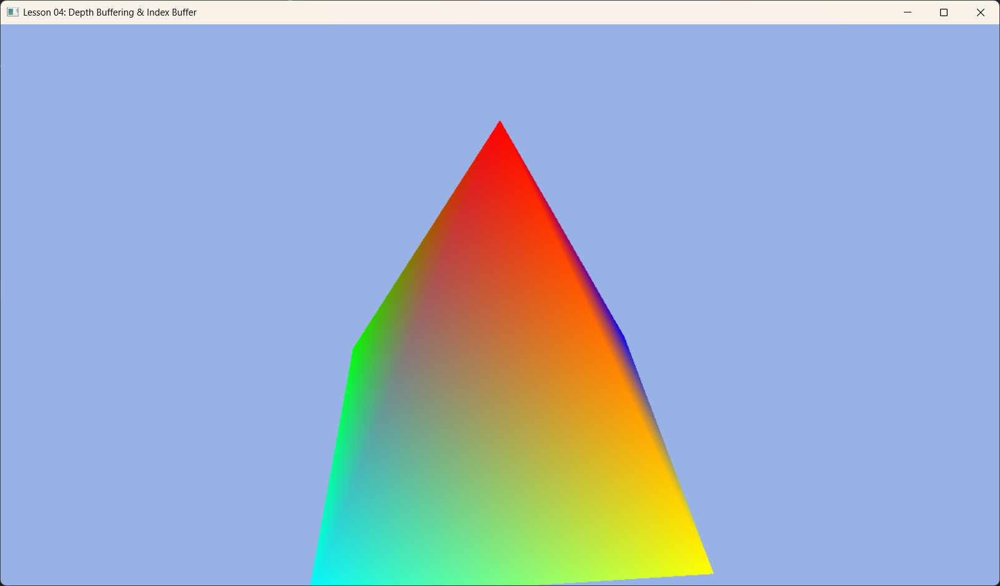

# Lesson 04: Depth Buffering & Index Buffers (深度缓冲与索引缓冲)



## 1. Introduction (引言)
在上一节课中，我们画了一个平面的三角形。但在 3D 世界中，物体是有前有后的。
如果先画远处的物体，再画近处的物体，画面是正确的（画家算法）。但在计算机图形学中，三角形的绘制顺序是不确定的。
这就引入了 **Depth Buffer (深度缓冲区)**，让像素自己决定“谁该显示”。

此外，我们还将学习 **Index Buffer (索引缓冲区)**，这是复用顶点的关键技术，以及如何通过 **Root Constants** 向 Shader 传递变换矩阵。

## 2. Core Concepts (核心概念)

### 2.1 Depth Buffer (深度缓冲)
深度缓冲区是一张和屏幕一样大的“黑白图片”，每个像素记录这该点当前的深度值（0.0 代表最近，1.0 代表最远）。
*   **规则**: 当 GPU 想要画一个新像素时，它会检查该像素的深度值 `Z_new`。
*   **比较**: 如果 `Z_new < Z_old` (更近)，则画上新颜色，并更新深度值。否则，丢弃该像素。
*   **结果**: 无论绘制顺序如何，近处的物体总会遮挡远处的物体。

### 2.2 Index Buffer (索引缓冲区)
想象你要画一个正方体。它有 8 个顶点，但需要分割成 12 个三角形（每个面 2 个）。
*   如果不复用顶点，你需要 $12 \times 3 = 36$ 个顶点数据。
*   如果使用索引，你只需要存储 8 个唯一顶点。然后用一个整数列表（索引）来描述三角形：`[0,1,2,  0,2,3 ...]`。
*   这大大节省了显存，并提高了 Vertex Cache 命中率。

### 2.3 Constant Buffer vs Root Constants
物体需要旋转，就需要矩阵。矩阵是变量，怎么传给 Shader？
*   **Descriptor Table**: 可以在堆里存海量数据（慢，容量大）。
*   **Root Constants**: 直接把数据塞在“根签名”里（极快，容量极小）。
*   本课中，一个 4x4 矩阵只有 16 个浮点数 (64字节)，非常适合放入 Root Constants。

---

## 3. Code Implementation (代码实现)

### 3.1 Initializing Depth Buffer (初始化深度缓冲)
深度缓冲区也是一个纹理资源，通常在初始化 DX12 时随 SwapChain 一起创建（`VibeDX12App` 基类已帮我们处理）。
我们需要做的是在 **PSO** 中开启它。

```cpp
void DepthBufferingApp::BuildPSO() {
    D3D12_GRAPHICS_PIPELINE_STATE_DESC psoDesc = {};
    // ... 其他设置 ...

    // 1. 开启深度测试
    psoDesc.DepthStencilState.DepthEnable = TRUE;
    
    // 2. 允许写入深度 (遮挡后续的像素)
    psoDesc.DepthStencilState.DepthWriteMask = D3D12_DEPTH_WRITE_MASK_ALL;
    
    // 3. 比较规则：LESS (越小越近，越近越优先)
    psoDesc.DepthStencilState.DepthFunc = D3D12_COMPARISON_FUNC_LESS;

    // 4. 指定 DSV 格式 (必须与我们创建的 Depth Stencil 纹理格式匹配)
    psoDesc.DSVFormat = m_depthStencilFormat; // 通常为 DXGI_FORMAT_D24_UNORM_S8_UINT
    
    // ...
}
```

### 3.2 Root Signature with Constants (带常量的根签名)
我们需要告诉 GPU：“嘿，我会给你传 16 个浮点数（一个矩阵）”。

```cpp
void DepthBufferingApp::BuildRootSignature() {
    CD3DX12_ROOT_PARAMETER slotRootParameter[1];
    
    // InitAsConstants(参数数量, Shader寄存器号)
    // 16 个 float = 1 个 4x4 矩阵
    // register(b0)
    slotRootParameter[0].InitAsConstants(16, 0); 

    CD3DX12_ROOT_SIGNATURE_DESC rootSigDesc(1, slotRootParameter, 0, nullptr, D3D12_ROOT_SIGNATURE_FLAG_ALLOW_INPUT_ASSEMBLER_INPUT_LAYOUT);
    
    // ... 序列化并创建 ...
}
```

### 3.3 Geometry with Indices (带索引的几何体)
创建一个四棱锥，共 5 个顶点。

```cpp
void DepthBufferingApp::BuildGeometry() {
    // 1. 定义 5 个唯一顶点
    std::vector<Vertex> vertices = {
        { { 0.0f, 1.0f, 0.0f }, { 1.0f, 0.0f, 0.0f, 1.0f } },  // 0. 顶点
        { { -1.0f, -1.0f, -1.0f }, { 0.0f, 1.0f, 0.0f, 1.0f } }, // 1. 左后
        { { -1.0f, -1.0f, 1.0f }, { 0.0f, 0.0f, 1.0f, 1.0f } },  // 2. 左前
        { { 1.0f, -1.0f, 1.0f }, { 1.0f, 1.0f, 0.0f, 1.0f } },   // 3. 右前
        { { 1.0f, -1.0f, -1.0f }, { 0.0f, 1.0f, 1.0f, 1.0f } }   // 4. 右后
    };

    // 2. 定义索引 (每3个索引组成一个三角形)
    std::vector<uint16_t> indices = {
        0, 2, 3, // 前面
        0, 3, 4, // 右面
        // ... (共 6 个三角形，18 个索引)
    };

    // 3. 创建并上传 Vertex Buffer (同 Lesson 03) ...

    // 4. 创建并上传 Index Buffer (完全类似 Vertex Buffer)
    // 略... 都是 CreateCommittedResource + Map + Copy + Unmap

    // 5. 创建 Index Buffer View
    m_indexBufferView.BufferLocation = m_indexBuffer->GetGPUVirtualAddress();
    m_indexBufferView.Format = DXGI_FORMAT_R16_UINT; // 这里我们用了 16 位索引
    m_indexBufferView.SizeInBytes = ibByteSize;
}
```

### 3.4 The Draw Call (绘制循环)
现在我们需要在渲染循环中清除深度缓冲区，并使用索引绘制。

```cpp
void DepthBufferingApp::OnRender() {
    // ... Reset Command List ...

    // 1. 清除
    auto rtvHandle = CurrentBackBufferView();
    auto dsvHandle = DepthStencilView(); // 获取深度缓冲视图句柄

    // 清除颜色 (背景色)
    m_commandList->ClearRenderTargetView(rtvHandle, Colors::LightBlue, 0, nullptr);
    
    // 清除深度 (重置为 1.0f)
    m_commandList->ClearDepthStencilView(dsvHandle, D3D12_CLEAR_FLAG_DEPTH | D3D12_CLEAR_FLAG_STENCIL, 1.0f, 0, 0, nullptr);
    
    // 绑定 Render Target 和 Depth Stencil Target
    m_commandList->OMSetRenderTargets(1, &rtvHandle, true, &dsvHandle);

    // 2. 设置几何体
    m_commandList->IASetVertexBuffers(0, 1, &m_vertexBufferView);
    m_commandList->IASetIndexBuffer(&m_indexBufferView); // 绑定索引
    m_commandList->IASetPrimitiveTopology(D3D_PRIMITIVE_TOPOLOGY_TRIANGLELIST);

    // 3. 更新并传递矩阵 (让物体转起来)
    // worldViewProj 矩阵在 OnUpdate 中计算
    m_commandList->SetGraphicsRoot32BitConstants(0, 16, &m_worldViewProj, 0);

    // 4. 索引绘制 (DrawIndexed)
    // DrawIndexedInstanced(索引数量, 实例数, ...)
    m_commandList->DrawIndexedInstanced(m_indexCount, 1, 0, 0, 0);

    // ... Present ...
}
```

### 总结
有了 **深度缓冲**，我们终于进入了真正的 3D 世界，不用担心物体的遮挡问题。
有了 **索引缓冲**，我们可以高效地构建复杂的几何体。
有了 **Root Constants**，我们可以让静态的物体动起来（旋转、缩放、位移）。

这三者是构建任何 3D 引擎的基石。

