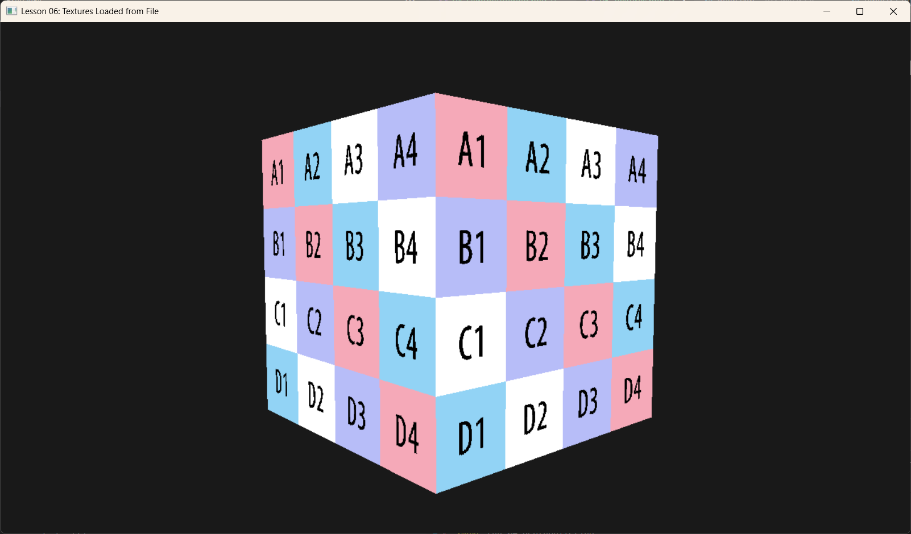

# Lesson 05-1: Loading Textures from File (加载图片文件)



## 1. Introduction (引言)
在 Lesson 05 中，我们通过代码手动生成了一个棋盘格纹理。但在真正的游戏开发中，纹理都是由美术人员制作好的图片文件（如 .jpg, .png）。
本节课我们将引入一个极为流行的单头文件库 **stb_image.h**，通过通过它将磁盘上的图片加载到内存，并最终上传到 GPU。

## 2. Core Concepts (核心概念)

### 2.1 Image Loading (图片解码)
图片文件（如 JPEG, PNG）里的数据是经过压缩的。GPU 无法直接理解 JPEG 的霍夫曼编码。
我们需要先在 CPU 端将这些压缩数据**解码 (Decode)** 成原始的像素数组（例如 `[R, G, B, A, R, G, B, A, ...]`）。
`stb_image` 帮我们完成了这项繁重的工作。

### 2.2 Row Pitch Alignment (行对齐)
这是新手最容易踩的坑。
*   **紧凑数据**: stb_image 解码出的数据是紧凑的。如果图片宽 100 像素，每行就是 400 字节。
*   **DX12 要求**: 为了硬件读取效率，DX12 要求上传到 Buffer 的纹理数据，每一行的大小必须是 **256 字节的倍数**。
这意味着我们不能直接 `memcpy` 整块数据，而必须一行一行地拷贝，并在每行末尾跳过填充字节。

---

## 3. Code Implementation (代码实现)

### 3.1 Importing stb_image
首先，我们需要引入这个库。它非常轻量，不需要编译成 .lib，直接定义宏即可实现。

```cpp
#define STB_IMAGE_IMPLEMENTATION
#include <stb_image.h>
```

### 3.2 Loading from Disk (从磁盘加载)

```cpp
void TexturesLoadApp::BuildTexture() {
    int width, height, channels;
    // 强制加载为 4 通道 (RGBA)，简化后续处理
    unsigned char* img = stbi_load("Assets/512x512_Texel_Density_Texture_1.png", &width, &height, &channels, 4);
    
    if (!img) {
        // 如果找不到，尝试往上级目录找找（应对不同的运行路径）
        img = stbi_load("../../Assets/512x512_Texel_Density_Texture_1.png", &width, &height, &channels, 4);
    }
    
    if (!img) {
        throw std::runtime_error("Failed to load texture!");
    }

    // ... (后续上传) ...
    
    // 记得释放内存！stb 使用 malloc 分配的内存需要手动 free
    // 但要在数据上传到 GPU 或 Upload Heap 之后再释放
    // stbi_image_free(img); 
}
```

### 3.3 Calculating Footprint & Uploading (计算布局与上传)
这是最关键的一步。我们需要询问 DX12：“如果是这种格式的纹理，在 Buffer 里应该怎么摆放？”

```cpp
    // 1. 创建 Default Heap 纹理 (GPU 专用)
    D3D12_RESOURCE_DESC textureDesc = {};
    textureDesc.Width = width;
    textureDesc.Height = height;
    textureDesc.Format = DXGI_FORMAT_R8G8B8A8_UNORM;
    // ...
    m_d3dDevice->CreateCommittedResource(..., D3D12_HEAP_TYPE_DEFAULT, ... &m_texture);

    // 2. 计算上传所需的空间和布局 (Row Pitch)
    D3D12_PLACED_SUBRESOURCE_FOOTPRINT footprint;
    UINT64 rowSizeInBytes; // 实际每行有效数据的字节数 (width * 4)
    UINT64 totalBytes;     // 加上对齐填充后的总字节数
    
    m_d3dDevice->GetCopyableFootprints(&textureDesc, 0, 1, 0, &footprint, nullptr, &rowSizeInBytes, &totalBytes);
  
    // 3. 创建上传堆
    auto bufferDesc = CD3DX12_RESOURCE_DESC::Buffer(totalBytes);
    m_d3dDevice->CreateCommittedResource(..., D3D12_HEAP_TYPE_UPLOAD, ... &m_textureUploadHeap);

    // 4. 逐行拷贝 (CPU Memory -> Upload Heap)
    BYTE* pMappedData = nullptr;
    m_textureUploadHeap->Map(0, nullptr, reinterpret_cast<void**>(&pMappedData));

    BYTE* pDestSlice = pMappedData + footprint.Offset;
    const BYTE* pSrcSlice = img;
    
    for (UINT y = 0; y < height; ++y)
    {
        // 目标地址：必须按照 calculated footprint 的 RowPitch 来偏移
        // 源地址：stb 的数据是紧凑的，直接 y * width * 4
        memcpy(pDestSlice + y * footprint.Footprint.RowPitch,
               pSrcSlice + y * width * 4,
               width * 4);
    }
    
    m_textureUploadHeap->Unmap(0, nullptr);
    
    // 5. 将 stb 内存释放 (我们已经拷到 Upload Heap 了)
    stbi_image_free(img);
```

### 3.4 Copy to Default Heap (拷贝到显存)
最后一步和之前一样，发命令让 GPU 把数据从 Upload Heap 搬运到 Default Heap。

```cpp
    CD3DX12_TEXTURE_COPY_LOCATION dst(m_texture.Get(), 0);
    CD3DX12_TEXTURE_COPY_LOCATION src(m_textureUploadHeap.Get(), footprint);
    
    m_commandList->CopyTextureRegion(&dst, 0, 0, 0, &src, nullptr);
    
    // 别忘了资源屏障
    // ...
```

## 4. Summary (总结)
通过 `stb_image` 和正确的内存对齐处理，我们解除了只能用程序生成纹理的限制。
虽然代码中涉及到了繁琐的 `GetCopyableFootprints` 和逐行拷贝，但这正是 DX12 赋予我们的掌控力——你必须清楚每一个字节在显存中是如何排列的。

现在，你可以把你喜欢的任何图片（墙纸、地面、天空盒）加载进你的 3D 引擎了！

