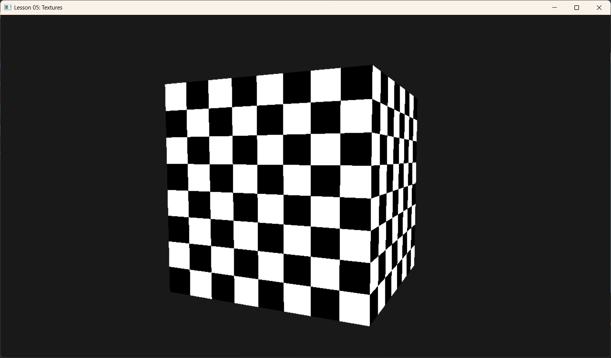

# Lesson 05: Textures (纹理材质)



## 1. Introduction (引言)
光有颜色是不够的，现实世界的物体表面充满了细节：木纹、砖缝、皮肤毛孔。如果不使用纹理，我们可能需要数百万个微小的三角形来模拟这些细节。
**Texture (纹理)** 是一种将图像（照片或生成的图案）“贴”在几何体表面的技术。就像给素模贴上墙纸。

在 DX12 中，使用纹理比 OpenGL/DX11 要繁琐一些，因为它引入了 **Descriptor Table (描述符表)** 和 **Heap (堆)** 的概念。

## 2. Core Concepts (核心概念)

### 2.1 Texture Mapping (纹理映射)
怎么把一张 2D 图片贴到 3D 立方体上？
我们需要 **UV 坐标**。每个顶点除了有位置 $(x,y,z)$，还需要纹理坐标 $(u,v)$。
*   $(0,0)$ 通常是图片左上角。
*   $(1,1)$ 通常是图片右下角。
当 GPU 绘制三角形内部像素时，它会根据顶点的 UV 进行插值，算出当前像素对应图片的哪个位置，然后去“采样”颜色。

### 2.2 SRV (Shader Resource View)
显卡里有很多资源（Buffer, Texture）。Shader 不能直接“拿起一张 JPG”就用。
我们需要创建一个 **SRV (着色器资源视图)**。
*   SRV 就像一个说明书：“这块内存是 2D 纹理，格式是 RGBA，有 1 层 Mipmap”。
*   这个 SRV 存放在 **Descriptor Heap** 中。

### 2.3 Descriptor Table (描述符表)
Root Signature 不能无限大。传一个 64bit 的指针是极限了。
所以我们不直接传纹理，而是传一个“指针”，指向 Descriptor Heap 中的某一段区域。这一段区域可能包含 1 个纹理，也可能包含 10 个纹理。这就被称为 **Descriptor Table**。

### 2.4 Sampler (采样器)
当我们去读取纹理时，如果坐标是 $(0.55, 0.55)$，但图片只有 $100 \times 100$ 像素，该取第 55 个像素还是第 56 个？或者混合它们？
这就由 Sampler 决定：
*   **Point (点采样)**: 取最近的像素，会有马赛克。
*   **Linear (线性采样)**: 混合周围像素，模糊但平滑。
以及 Wrap Mode：如果 UV 超过 1.0 怎么办？重复 (Repeat) 还是拉伸 (Clamp)？

---

## 3. Code Implementation (代码实现)

### 3.1 Creating and Uploading Texture (创建与上传)
在本课中，我们手动生成一个黑白方格图 (Checkerboard)，并上传到 GPU。
*注意：纹理数据通常需要按行对齐 (Row Pitch Alignment)，DX12 对此非常严格。*

```cpp
void TexturesApp::BuildTexture() {
    // 1. 在 CPU 端生成数据 (黑白棋盘格)
    const UINT TextureWidth = 256;
    const UINT TextureHeight = 256;
    std::vector<UINT8> data(TextureWidth * TextureHeight * 4); // RGBA
    // ... (生成代码，看源码 src/main.cpp) ...

    // 2. 创建 Default Heap 纹理 (这是 GPU 最终用来采样的资源)
    // CPU 无法直接写入这里，所以我们只申请空间
    D3D12_RESOURCE_DESC textureDesc = {};
    textureDesc.Dimension = D3D12_RESOURCE_DIMENSION_TEXTURE2D;
    textureDesc.Format = DXGI_FORMAT_R8G8B8A8_UNORM;
    textureDesc.Width = TextureWidth;
    textureDesc.Height = TextureHeight;
    // ...
    m_d3dDevice->CreateCommittedResource(..., D3D12_HEAP_TYPE_DEFAULT, ... &m_texture);

    // 3. 创建 Upload Heap 缓冲区 (中间人)
    // 用于把 CPU 数据传给 GPU
    // 首先计算上传这一张图需要多大的缓冲（考虑行对齐）
    UINT64 uploadBufferSize = GetRequiredIntermediateSize(m_texture.Get(), 0, 1);
    
    m_d3dDevice->CreateCommittedResource(..., D3D12_HEAP_TYPE_UPLOAD, ... &m_textureUploadHeap);

    // 4. 更新子资源 (使用 d3dx12.h 的辅助函数)
    // UpdateSubresources 会自动处理 Row Pitch 对齐问题
    D3D12_SUBRESOURCE_DATA textureData = {};
    textureData.pData = data.data();
    textureData.RowPitch = TextureWidth * 4;
    textureData.SlicePitch = textureData.RowPitch * TextureHeight;

    UpdateSubresources(m_commandList.Get(), m_texture.Get(), m_textureUploadHeap.Get(), 0, 0, 1, &textureData);

    // 5. 改变状态：从“拷贝目标”变为“像素着色器资源”
    auto barrier = CD3DX12_RESOURCE_BARRIER::Transition(
        m_texture.Get(), 
        D3D12_RESOURCE_STATE_COPY_DEST, 
        D3D12_RESOURCE_STATE_PIXEL_SHADER_RESOURCE);
    m_commandList->ResourceBarrier(1, &barrier);
}
```

### 3.2 Descriptor Heap & SRV
有了纹理资源，还得给它办个“身份证” (SRV) 并放入“卡包” (Descriptor Heap)。

```cpp
void TexturesApp::BuildDescriptorHeaps() {
    // 1. 创建 Heap (类型是 CBV_SRV_UAV)
    D3D12_DESCRIPTOR_HEAP_DESC srvHeapDesc = {};
    srvHeapDesc.NumDescriptors = 1; // 卡包里只有 1 张卡
    srvHeapDesc.Type = D3D12_DESCRIPTOR_HEAP_TYPE_CBV_SRV_UAV;
    srvHeapDesc.Flags = D3D12_DESCRIPTOR_HEAP_FLAG_SHADER_VISIBLE; //重要：Shader可见
    m_d3dDevice->CreateDescriptorHeap(&srvHeapDesc, IID_PPV_ARGS(&m_srvHeap));

    // 2. 创建 SRV
    D3D12_SHADER_RESOURCE_VIEW_DESC srvDesc = {};
    srvDesc.Format = DXGI_FORMAT_R8G8B8A8_UNORM;
    srvDesc.ViewDimension = D3D12_SRV_DIMENSION_TEXTURE2D;
    srvDesc.Texture2D.MipLevels = 1;
    
    // 把 SRV 创建在 Heap 的第一个槽位 (Start)
    m_d3dDevice->CreateShaderResourceView(
        m_texture.Get(), 
        &srvDesc, 
        m_srvHeap->GetCPUDescriptorHandleForHeapStart());
}
```

### 3.3 Root Signature with Table & Sampler
```cpp
void TexturesApp::BuildRootSignature() {
    // A. 定义描述符表范围 (Range)
    CD3DX12_DESCRIPTOR_RANGE texTable;
    // 类型SRV, 数量1, 绑定到 register(t0)
    texTable.Init(D3D12_DESCRIPTOR_RANGE_TYPE_SRV, 1, 0);

    // B. 定义根参数
    CD3DX12_ROOT_PARAMETER slotRootParameter[2];
    slotRootParameter[0].InitAsConstants(16, 0); // Param 0: Matrix
    // Param 1: 一个描述符表
    slotRootParameter[1].InitAsDescriptorTable(1, &texTable, D3D12_SHADER_VISIBILITY_PIXEL);

    // C. 定义静态采样器 (Static Sampler)
    // 通常采样器是固定的，直接写在 Root Signature 里最方便
    // 效果：Point Filter (马赛克), Wrap Mode (平铺)
    D3D12_STATIC_SAMPLER_DESC sampler = {};
    sampler.Filter = D3D12_FILTER_MIN_MAG_MIP_POINT;
    sampler.AddressU = D3D12_TEXTURE_ADDRESS_MODE_WRAP;
    sampler.AddressV = D3D12_TEXTURE_ADDRESS_MODE_WRAP;
    sampler.ShaderRegister = 0; // register(s0)

    // 创建根签名
    CD3DX12_ROOT_SIGNATURE_DESC rootSigDesc(2, slotRootParameter, 1, &sampler, ...);
    // ...
}
```

### 3.4 Shaders (HLSL)
Shader 需要接收纹理 $(t0)$ 和采样器 $(s0)$。

```hlsl
// 输入增加了纹理坐标
struct VertexIn {
    float3 PosL : POSITION;
    float2 TexC : TEXCOORD;
};

// 绑定资源
Texture2D    gDiffuseMap : register(t0);
SamplerState gsamPoint   : register(s0);

float4 PS(VertexOut pin) : SV_Target {
    // 使用采样器，根据 UV 坐标在 Texture 上取色
    return gDiffuseMap.Sample(gsamPoint, pin.TexC);
}
```

### 3.5 Rendering (设置并绘制)
最后，在 `OnRender` 循环中，我们需要绑定这个 Heap 和 Table。

```cpp
void TexturesApp::OnRender() {
    // ...
    // 设置描述符堆 (必须在 SetGraphicsRootDescriptorTable 之前！)
    ID3D12DescriptorHeap* descriptorHeaps[] = { m_srvHeap.Get() };
    m_commandList->SetDescriptorHeaps(1, descriptorHeaps);

    // 绑定 Root Signature
    m_commandList->SetGraphicsRootSignature(m_rootSignature.Get());
    
    // 绑定参数 0 (矩阵)
    m_commandList->SetGraphicsRoot32BitConstants(0, 16, &m_worldViewProj, 0);

    // 绑定参数 1 (描述符表 -> 纹理 SRV)
    // 传入 Heap 的 GPU 句柄
    m_commandList->SetGraphicsRootDescriptorTable(1, m_srvHeap->GetGPUDescriptorHandleForHeapStart());

    // 绘制
    m_commandList->DrawIndexedInstanced(...);
}
```

### 总结
这就是 DX12 的纹理管线：
1.  **资源**: 创建 Texture 资源，把图片数据上传进去。
2.  **视图**: 创建 SRV，放入 Descriptor Heap。
3.  **签名**: Root Signature 定义 Table 和 Sampler。
4.  **绑定**: 在 Render Loop 中 `SetDescriptorHeaps` 和 `SetGraphicsRootDescriptorTable`。

虽然繁琐，但这赋予了引擎极大的灵活性——你可以准备好几千张纹理的 Heap，然后在绘制时仅仅切换一个“指针”就能换整套材质。

