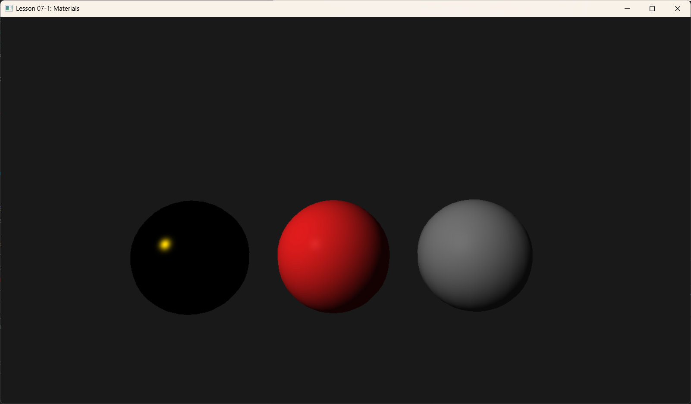

# Lesson 07-1: Materials System (材质系统)



## 1. Introduction (简介)

在上一节（Basic Lighting）中，我们实现了一个光照模型，但所有物体看起来都像是同一种“白色塑料”。在现实世界中，金属、塑料、木材、布料对光的反应是截然不同的。

本节我们将引入 **Material (材质)** 的概念。我们将定义一组参数来描述物体表面的物理属性，而不是简单地硬编码颜色。这虽然还不是完全的 PBR (Physically Based Rendering)，但引入了 PBR 的两个核心属性：**Roughness (粗糙度)** 和 **Fresnel Effect (菲涅尔效应)**。

---

## 2. Key Concepts (核心概念)

### 2.1 Diffuse Albedo (漫反射率 / 固有色)
这是物体最基础的颜色。金属通常没有漫反射颜色（或是全黑），而非金属（绝缘体）则表现为我们看到的颜色。

### 2.2 Roughness (粗糙度)
描述表面的微观光滑程度。
*   **Smooth (Roughness ≈ 0)**: 表面像镜子一样，光线反射方向集中。高光点（Specular Highlight）非常小且非常亮。
*   **Rough (Roughness ≈ 1)**: 表面微观上凹凸不平，光线向四面八方散射。高光点变得大而模糊，甚至不可见。

### 2.3 Fresnel R0 (菲涅尔反射率)
你是否注意过，如果你以非常平的角度（grazing angle）观察一个不反光的物体（比如木地板或书本封面），它会变得像镜子一样反光？这就是**菲涅尔效应**。

*   **R0 (F0)**: 当光线垂直入射（0度角）时的反射率。
*   **Dielectrics (绝缘体/非金属)**: R0 很低（通常在 0.02 ~ 0.05 之间），反射主要靠菲涅尔效应。
*   **Metals (金属/导体)**: R0 很高（0.5 ~ 1.0），且通常带有颜色（如金色的 R0 是黄色的）。

---

## 3. Code Implementation (代码实现)

### 3.1 Render Item (渲染项架构)
为了管理场景中的多个物体，我们不再在 `Draw` 函数里写死每一个 Draw Call。我们引入一个微型引擎架构 `RenderItem`。

```cpp
struct RenderItem {
    // 1. World Transform
    XMFLOAT4X4 World = MatrixIdentity4x4();
    
    // 2. Material Properties
    XMFLOAT4 DiffuseAlbedo = { 1.0f, 1.0f, 1.0f, 1.0f };
    XMFLOAT3 FresnelR0 = { 0.1f, 0.1f, 0.1f }; // F0
    float Roughness = 0.5f;

    // 3. Geometry Info
    UINT IndexCount = 0;
    UINT StartIndexLocation = 0;
    INT BaseVertexLocation = 0;
};
```

我们在 `BuildRenderItems` 中定义场景：
*   **Center Sphere**: 红色塑料 (Low R0, Medium Roughness)
*   **Left Sphere**: 黄金 (Yellow High R0, Low Roughness)
*   **Right Sphere**: 粗糙生铁 (Grey High R0, High Roughness)
*   **Ground**: 地板 (Grey, Medium Roughness)

### 3.2 Update Logic (更新逻辑)
每一帧，我们都需要将当前正在绘制的 `RenderItem` 的属性传给 Shader。
这里我们再次扩充了 Root Constants（注意：在实际生产中，通常会将材质数据放入结构化缓冲区 StructuredBuffer，这里为了演示方便直接传参）。

```cpp
// 常量缓冲区结构 (56 floats)
struct ObjectConstants {
    XMFLOAT4X4 World;
    XMFLOAT4X4 ViewProj;
    XMFLOAT3 EyePosW;
    float Pad0;

    // --- Material Data ---
    XMFLOAT4 DiffuseAlbedo;
    XMFLOAT3 FresnelR0;
    float Roughness;
    // ---------------------

    XMFLOAT3 LightDir;
    // ...
};
```

### 3.3 Shader HLSL：Schlick 近似
在 Pixel Shader 中，我们使用 Schlick 近似公式来计算菲涅尔反射。

```hlsl
// Schlick Approximation for Fresnel
float3 SchlickFresnel(float3 R0, float3 normal, float3 lightVec)
{
    float cosTheta = saturate(dot(normal, lightVec)); // N dot L
    // 菲涅尔效应：随着角度变平（cosTheta 变小），反射率急剧增加
    return R0 + (1.0f - R0) * pow(1.0f - cosTheta, 5.0f);
}
```
在高光计算中，我们使用 `Roughness` 来控制高光的衰减范围（Shininess）。
```hlsl
// 粗糙度转 Shininess (经验公式)
float shininess = (1.0f - gRoughness) * MAX_SHININESS; 

// Specular 计算中使用 SchlickFresnel 得到的反射率
float3 fresnelFactor = SchlickFresnel(gFresnelR0, N, L);
specular = specFactor * fresnelFactor * gLightColor;
```

---

## 4. Summary (总结)

通过引入材质系统，我们不用再为每个物体写不同的 Shader。所有的物体共用同一套光照公式，但通过调整 **Parameters (参数)** —— `DiffuseAlbedo`、`Roughness`、`FresnelR0` —— 就能表现出黄金、塑料、橡胶等截然不同的质感。

这为后续更复杂的渲染（如 PBR 贴图工作流）打下了基础。但在那之前，我们需要学习如何给材质加上纹理（Textures），让表面不仅有光泽，还有图案。

下一节课：**Textured Lighting (纹理光照)**。
