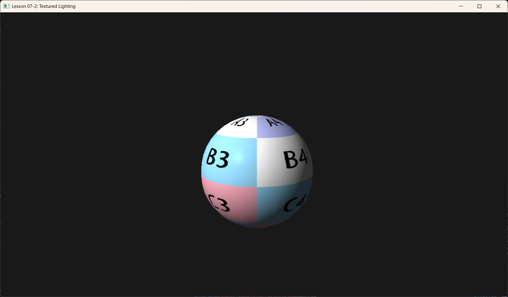

# Lesson 07-2: Textured Lighting (纹理光照)


*Source: LearnOpenGL.com*
*(Lighting only)*
vs

*(Lighting + Texture)*

## 1. Introduction (简介)

在 Lesson 05 中，我们学会了如何贴图；在 Lesson 07 中，我们学会了如何计算光照。现在的任务是将两者结合起来。

这是 3D 渲染中最常见的模式：**纹理 (Texture)** 提供高频的表面颜色细节，而 **光照 (Lighting)** 提供宏观的体积感和深度感。

---

## 2. Core Logic (核心逻辑)

并没有什么深奥的新理论，核心在于 Pixel Shader 中的组合逻辑：

1.  **Sampling**: 先根据 UV 坐标采样纹理，得到该像素的“固有色” (Albedo)。
2.  **Modulation**: 将这个固有色作为一个乘数，应用到光照公式的 `Ambient` (环境光) 和 `Diffuse` (漫反射) 分量上。
3.  **Specular**: **不要**将纹理颜色乘到高光上（由 Specular 分量决定）。高光通常反映的是光源的颜色（对于非金属），或者金属自身的反射属性（对于金属）。

**Formula**:
$$ FinalColor = ( Ambient + Diffuse ) \times TextureColor + Specular $$

---

## 3. Code Implementation (代码实现)

### 3.1 Root Signature Update

我们需要同时把材质参数（Root Constants）和纹理（Descriptor Table）传给 Shader。此外还需要一个采样器（Static Sampler）。

```cpp
void BuildRootSignature() {
    CD3DX12_ROOT_PARAMETER slotRootParameter[2];
    
    // Parameter 0: Material / Object Constants (b0)
    slotRootParameter[0].InitAsConstants(56, 0); 
    
    // Parameter 1: Texture SRV Table (t0)
    CD3DX12_DESCRIPTOR_RANGE texTable;
    texTable.Init(D3D12_DESCRIPTOR_RANGE_TYPE_SRV, 1, 0);
    slotRootParameter[1].InitAsDescriptorTable(1, &texTable, D3D12_SHADER_VISIBILITY_PIXEL);

    // Static Sampler (s0)
    CD3DX12_STATIC_SAMPLER_DESC sampler(0, D3D12_FILTER_MIN_MAG_MIP_LINEAR);

    // ... Create Root Signature
}
```

### 3.2 Binding Resources

在渲染循环 (`OnRender`) 中，我们需要分别绑定这两个参数。

```cpp
// 1. 设置 Root Signature
m_commandList->SetGraphicsRootSignature(m_rootSignature.Get());

// 2. 绑定 Constant Buffer / Root Constants
m_commandList->SetGraphicsRoot32BitConstants(0, 56, &m_objConstants, 0);

// 3. 绑定 Texture Descriptor Table
// 注意：我们需要获取 SRV Heap 的 GPU Handle
m_commandList->SetDescriptorHeaps(1, m_srvHeap.GetAddressOf());
m_commandList->SetGraphicsRootDescriptorTable(1, m_srvHeap->GetGPUDescriptorHandleForHeapStart());
```

### 3.3 Shader HLSL

最重要的部分在 Pixel Shader 中。

```hlsl
// Pixel Shader
float4 PS(VertexOut pin) : SV_Target
{
    // 1. 获取纹理颜色
    float4 texColor = gDiffuseMap.Sample(gsamLinear, pin.TexC);
    
    // 2. 结合材质本身的 DiffuseAlbedo (可选，通常设为白色)
    // 这样可以在只有白色纹理的情况下，通过 DiffuseAlbedo 染成红色
    float4 baseColor = texColor * gDiffuseAlbedo;

    // 3. alpha test (可选)
    // clip(baseColor.a - 0.1f);

    // 4. 光照计算
    float3 N = normalize(pin.NormalW);
    float3 L = normalize(-gLightDir);
    float3 V = normalize(gEyePosW - pin.PosW);
    float3 R = reflect(-L, N);

    // Ambient
    float4 ambient = gAmbientLight * baseColor;

    // Diffuse
    float diffFactor = max(dot(N, L), 0.0f);
    float4 diffuse = diffFactor * gLightColor * baseColor;

    // Specular (注意：不乘 baseColor)
    // 除非是金属工作流，否则高光颜色由材质的 FresnelR0 和光源颜色决定
    float4 specular = float4(0,0,0,0);
    if(diffFactor > 0.0f)
    {
         float3 fresnel = SchlickFresnel(gFresnelR0, N, L);
         float shininess = (1.0f - gRoughness) * MAX_SHININESS;
         float specFactor = pow(max(dot(R, V), 0.0f), shininess);
         specular = float4(specFactor * fresnel * gLightColor.rgb, 0.0f);
    }

    float4 finalColor = ambient + diffuse + specular;
    finalColor.a = baseColor.a; // Preserve alpha
    return finalColor;
}
```

---

## 4. Summary (总结)

至此，基础渲染课程的主要内容已经覆盖完毕：
*   **Geometry**: Meshes, Vertices, Indices.
*   **Transform**: World, View, Projection Matrices.
*   **Rasterization**: Viewport, Scissor, Depth Buffer.
*   **Textures**: UV mapping, Sampling, Address modes.
*   **Lighting**: Normals, Phong Model, Materials.

这构成了所谓 "Standard Pipeline" (标准管线) 的核心。接下来的课程将进入更高级的主题，或者是对管线功能的扩充（如混合、模板测试、几何着色器等）。

下一节课：**Blending (混合)** - 实现半透明效果。
