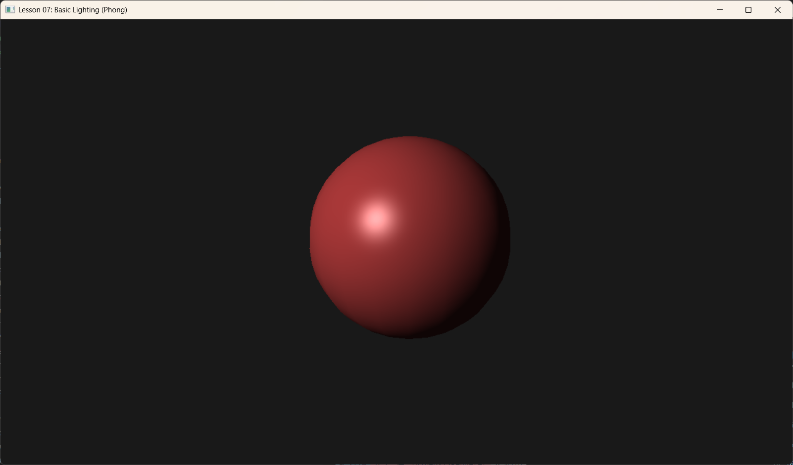

# Lesson 07: Basic Lighting (Phong Model) (基础光照)



## 1. Introduction (简介)

在之前的课程中，我们渲染的物体要么是单色的，要么直接使用了纹理颜色。虽然纹理提供了表面细节，但物体并没有体现出“体积感”或“深度感”。在 3D 图形学中，**光照 (Lighting)** 是让场景变得真实的关键因素。

本节我们将实现一个最经典的光照模型——**Phong Reflection Model (Phong 反射模型)**。

Phong 模型将光照分为三个分量：
1.  **Ambient (环境光)**: 模拟场景中四处散射的背景光，照亮物体的阴影区域。
2.  **Diffuse (漫反射)**: 光线照射到粗糙表面后向各个方向散射的光。它取决于光线与表面法线的夹角（Lambert's Cosine Law）。
3.  **Specular (高光/镜面反射)**: 光线照射到光滑表面后反射出的亮斑。它取决于视线与反射光线的夹角。

最终颜色 = Ambient + Diffuse + Specular。

*Source: Wikimedia Commons*


---

## 2. Key Concepts (核心概念)

### 2.1 Vertex Normals (顶点法线)
为了计算光线如何从表面反射，我们需要知道表面“朝向”哪里。在 3D 图形中，这是通过**法线 (Normal)** 向量来表示的。
*   法线是一个垂直于表面的单位向量。
*   对于此课程中的球体 (Sphere)，球面上任意一点的法线方向就是从球心指向该点的方向。

### 2.2 Light Source (光源)
为了简化计算，我们在本节使用 **Directional Light (平行光)**。
*   模拟太阳光，光线是平行的。
*   不需要考虑光的衰减（Attenuation）。
*   只需要一个方向向量 `LightDir` 和颜色 `LightColor`。

---

## 3. Code Implementation (代码实现)

### 3.1 C++ 端：定义数据结构

首先，我们需要在顶点数据中加入法线信息。

```cpp
// 顶点结构体更新
struct Vertex {
    XMFLOAT3 Pos;    // 位置
    XMFLOAT3 Normal; // 法线 (New)
};

// ... 定义 Input Layout ...
m_inputLayout = {
    { "POSITION", 0, DXGI_FORMAT_R32G32B32_FLOAT, 0, 0, ... },
    { "NORMAL", 0, DXGI_FORMAT_R32G32B32_FLOAT, 0, 12, ... } // Offset 12 bytes
};
```

接着，我们需要将光照所需的参数传给 Shader。由于参数较多（矩阵 + 光照参数），我们扩展了 `ObjectConstants` 结构，使用 Root Constants 传递 48 个 float 值。

```cpp
struct ObjectConstants {
    XMFLOAT4X4 World;      // 世界矩阵
    XMFLOAT4X4 ViewProj;   // 视口投影矩阵
    XMFLOAT3 EyePosW;      // 摄像机位置 (用于计算高光)
    float Pad0;            // 填充对齐
    XMFLOAT3 LightDir;     // 平行光方向
    float Pad1;            // 填充对齐
    XMFLOAT4 LightColor;   // 光照颜色
    XMFLOAT4 AmbientColor; // 环境光颜色
};
```

### 3.2 C++ 端：生成球体几何体

为了展示光照效果，球体是一个完美的测试模型，因为它的法线是连续变化的。我们在 `BuildGeometry` 中通过程序化生成球体的顶点和索引。

关键点在于法线的计算：
```cpp
// x, y, z 是球面上一点的坐标
Vertex v;
v.Pos.x = radius * sinf(phi) * cosf(theta);
v.Pos.y = radius * cosf(phi);
v.Pos.z = radius * sinf(phi) * sinf(theta);

// 球面法线 = Position - Center(0,0,0) (归一化)
XMVECTOR p = XMLoadFloat3(&v.Pos);
XMStoreFloat3(&v.Normal, XMVector3Normalize(p));
```

### 3.3 Shader HLSL：实现 Phong 模型

我们需要编写新的 Vertex Shader 和 Pixel Shader。

**Vertex Shader**:
主要任务是将法线变换到世界空间。
> **注意**: 如果 `World` 矩阵包含非均匀缩放，法线变换不能直接使用 `World` 矩阵，而应该使用 `World` 的逆转置矩阵 (Inverse Transpose)。本例只涉及旋转和平移，可以直接使用 `World` 矩阵（取前 3x3）。

```hlsl
// Transforming Normal to World Space
vout.NormalW = mul(vin.NormalL, (float3x3)gWorld);
```

**Pixel Shader**:
这是光照计算发生的地方。

```hlsl
float4 PS(VertexOut pin) : SV_Target
{
    // 1. 标准化向量 (插值过程中长度可能会变)
    float3 N = normalize(pin.NormalW);
    float3 L = normalize(-gLightDir); // 光向量指向光源
    float3 V = normalize(gEyePosW - pin.PosW); // 视线向量
    
    // 2. Ambient (环境光)
    float4 ambient = gAmbientColor;

    // 3. Diffuse (漫反射)
    // Lambert's Law: max(dot(N, L), 0)
    float diffFactor = max(dot(N, L), 0.0f);
    float4 diffuse = diffFactor * gLightColor;

    // 4. Specular (高光)
    float4 specular = float4(0.0f, 0.0f, 0.0f, 0.0f);
    if(diffFactor > 0.0f) // 只有面向光源的面才有高光
    {
        float3 R = reflect(-L, N); // 反射向量
        // Phong 模型: pow(max(dot(R, V), 0), Shininess)
        float specFactor = pow(max(dot(R, V), 0.0f), 32.0f); // 32 is shininess
        specular = specFactor * gLightColor; // 假设高光颜色也是白色
    }

    // 5. Combine
    float4 finalColor = ambient + diffuse + specular;
    finalColor.a = 1.0f;
    
    return finalColor;
}
```

---

## 4. Summary (总结)

本节课我们完成了图形学中最重要的一步跃迁：**光照**。
1.  **Vertex Data**: 增加了 `Normal` 数据。
2.  **Geometry**: 程序化生成了一个球体 mesh。
3.  **Shader**: 实现了 Phong 光照模型，计算了 Ambient, Diffuse 和 Specular 分量。

现在的物体看起来有了立体感。但你会发现所有部分的“材质”看起来都一样（像是白色塑料）。下一节课，我们将引入 **Materials (材质)**，让不同的物体拥有不同的光学属性（如金属、木材等）。

        // Phong 模型: 计算光线的反射向量 R
        // v = reflect(i, n) => i 是入射光(指向表面), n 是法线
        float3 v = reflect(gLightDir, normalW);
        // 高光强度取决于 反射光 v 与 视线 toEyeW 的夹角
        float specFactor = pow(max(dot(v, toEyeW), 0.0f), gMaterial.Shininess);
        specular = specFactor * gLightColor * gMaterial.Specular;
    }

    // 最终颜色 = 环境 + 漫反射 + 高光
    float4 litColor = ambient + diffuse + specular;
    return litColor;
}
```
