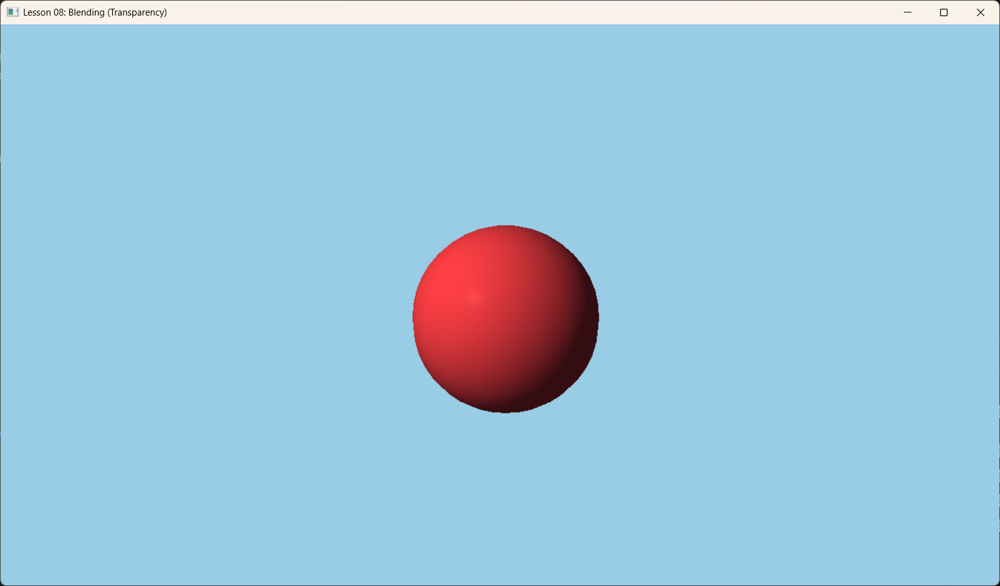

# Lesson 08: Blending (混合)



## 1. Introduction (简介)

在现实世界中，不是所有物体都是完全不透明的。玻璃、水、烟雾、甚至是半透明的塑料，它们会让光线穿过。

在渲染管线中，这发生在最后一步——**Output Merger (输出合并)** 阶段。当 Shader 计算出像素颜色后，我们不直接用它覆盖 Framebuffer，而是让它与 Framebuffer 中已有的颜色（Background Color）按照一定比例进行混合。

*Source: LearnOpenGL.com*

---

## 2. Core Concept (核心概念)

### 2.1 The Blending Equation (混合方程)
标准的透明混合（Alpha Blending）公式如下：

$$ C_{final} = C_{src} \times F_{src} + C_{dest} \times F_{dest} $$

*   **$C_{src}$**: 源颜色（当前正在绘制的像素 output）。
*   **$C_{dest}$**: 目标颜色（Framebuffer 中已经存在的颜色）。
*   **$F_{src}$**: 源因子，通常是 $\alpha$ (源 Alpha)。
*   **$F_{dest}$**: 目标因子，通常是 $1 - \alpha$ (One minus Source Alpha)。

> 这样，如果 Alpha=0.5，最终颜色就是一半新颜色，一半旧颜色。

### 2.2 Rendering Order (渲染顺序)
这是新手最容易踩的坑。**混合对顺序非常敏感**。

1.  **Opaque Objects (不透明物体)**:
    *   顺序不重要（因为有 Depth Buffer）。
    *   可以从前向后画（以减少 Overdraw）。
    *   **必须先画**。

2.  **Transparent Objects (透明物体)**:
    *   **必须后画**。原因：如果先画了前面的玻璃，深度缓冲会更新；再画玻璃后面的墙时，深度测试会失败（认为墙在玻璃后面被挡住了），导致墙根本画不出来，玻璃看起来就是黑的。
    *   **必须从后向前画 (Back-to-Front)**。
    *   为了正确叠加（由于 $(A+B)+C \neq A+(B+C)$ 在某些混合模式下），顺序必须固定。

---

## 3. Code Implementation (代码实现)

### 3.1 PSO: Enabling Blending (开启混合)
混合状态是 PSO 的一部分。这意味着我们需要为不透明物体和透明物体创建**两个不同的 PSO**。

```cpp
// 1. Opaque PSO (默认无混合)
// ...

// 2. Transparent PSO
D3D12_GRAPHICS_PIPELINE_STATE_DESC transPsoDesc = opaquePsoDesc;

D3D12_RENDER_TARGET_BLEND_DESC blendDesc = {};
blendDesc.BlendEnable = true;
blendDesc.LogicOpEnable = false;
blendDesc.SrcBlend = D3D12_BLEND_SRC_ALPHA; // source alpha
blendDesc.DestBlend = D3D12_BLEND_INV_SRC_ALPHA; // 1 - source alpha
blendDesc.BlendOp = D3D12_BLEND_OP_ADD;
blendDesc.SrcBlendAlpha = D3D12_BLEND_ONE;
blendDesc.DestBlendAlpha = D3D12_BLEND_ZERO;
blendDesc.BlendOpAlpha = D3D12_BLEND_OP_ADD;
blendDesc.RenderTargetWriteMask = D3D12_COLOR_WRITE_ENABLE_ALL;

transPsoDesc.BlendState.RenderTarget[0] = blendDesc; // Apply to Target 0

// 创建 Transparent PSO
m_d3dDevice->CreateGraphicsPipelineState(&transPsoDesc, IID_PPV_ARGS(&m_psoTransparent));
```

### 3.2 Separating Render Items (分离渲染项)
在代码中，我们将物体分为两组：我们有一个不透明的球体和地面，还有一个半透明的蓝色平面（代表水面）。

```cpp
// 红色球体
RenderItem sphere; 
sphere.DiffuseAlbedo = { 0.8f, 0.2f, 0.2f, 1.0f }; // Alpha = 1.0
m_opaqueItems.push_back(sphere);

// 蓝色水面
RenderItem water;
water.DiffuseAlbedo = { 0.0f, 0.2f, 1.0f, 0.5f }; // Alpha = 0.5
m_transparentItems.push_back(water);
```

### 3.3 Draw Call Loop (绘制循环)

```cpp
void OnRender() {
    // 1. Draw Opaque Items first
    m_commandList->SetPipelineState(m_psoOpaque.Get());
    DrawRenderItems(m_commandList.Get(), m_opaqueItems);

    // 2. Draw Transparent Items last
    m_commandList->SetPipelineState(m_psoTransparent.Get());
    DrawRenderItems(m_commandList.Get(), m_transparentItems);
}
```

---

## 4. Summary (总结)

本节我们不仅学习了如何设置 `D3D12_BLEND_DESC` 来开启混合，更重要的是理解了**透明渲染的原则**：
1.  **先不透明，后透明**。
2.  **透明物体需按深度排序**（虽然本例中只有一个透明物体，未涉及排序）。
3.  **Material Alpha**: 我们现在用 `DiffuseAlbedo.w` 来控制透明度。

下一节课：**Stenciling (模板测试)** -  从镜子反射到阴影体积，模板缓冲有许多神奇的用法。
    
    return litColor;
}
```
