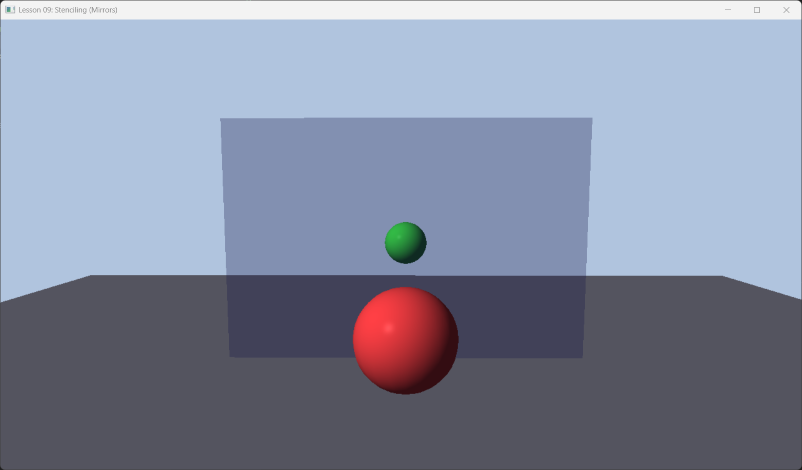

# Lesson 09: Stenciling & Mirrors (模板测试)



## 1. Introduction (简介)

**Stencil Buffer (模板缓冲)** 是一个与 Depth Buffer 也是经常绑定在一起的缓冲区（通常是 D24S8 格式，即 24位深度 + 8位模板）。
你可以把它想象成一个**遮罩 (Mask)** 或**镂空板**。我们可以控制 GPU 只在模板值为特定值的地方进行绘制。

本节我们将利用模板技术实现一个经典的图形学效果：**Planar Reflection (平面镜反射)**。

---

## 2. Core Logic (核心逻辑)

要在镜子里看到物体的倒影，最简单的方法是：把物体真的在镜子对面再画一次。
DirectXMath 提供了 `XMMatrixReflect(Plane)` 函数，可以生成一个反射矩阵。

但是有一个问题：如果镜子不是无限大的（例如挂在墙上的镜子），那么反射的物体可能会“穿帮”跑出镜子边界，画在墙上。

**Stencil Buffer 的解决方案**:
1.  **Marking**: 先在模板缓冲中标记出镜子的区域（设 Stencil = 1）。
2.  **Reflecting**: 绘制倒影，但告诉 GPU “只在 Stencil = 1 的地方画”。
3.  **Blending**: 最后在镜子位置画上一层半透明玻璃（模拟镜面材质）。

---

## 3. Code Implementation (代码实现)

我们需要的不仅仅是一个 PSO，而是针对这个流程的三个特化 PSO。

### 3.1 Step 1: Mark Mirror PSO
这个 PSO 负责“标记”。它不应该输出任何颜色，只写入 Stencil。

```cpp
// 深度模板描述
D3D12_DEPTH_STENCIL_DESC markMirrorDesc = {};
markMirrorDesc.DepthEnable = true;
markMirrorDesc.DepthWriteMask = D3D12_DEPTH_WRITE_MASK_ZERO; // 不写深度
markMirrorDesc.DepthFunc = D3D12_COMPARISON_FUNC_LESS;
markMirrorDesc.StencilEnable = true;
markMirrorDesc.StencilReadMask = 0xff;
markMirrorDesc.StencilWriteMask = 0xff;

// 无论深度测试是否通过，都将 Stencil 替换为 Ref 值
markMirrorDesc.FrontFace.StencilFailOp = D3D12_STENCIL_OP_KEEP;
markMirrorDesc.FrontFace.StencilDepthFailOp = D3D12_STENCIL_OP_KEEP;
markMirrorDesc.FrontFace.StencilPassOp = D3D12_STENCIL_OP_REPLACE;
markMirrorDesc.FrontFace.StencilFunc = D3D12_COMPARISON_FUNC_ALWAYS;

// Color Write Mask 设为 0 (禁止写入颜色)
blendDesc.RenderTargetWriteMask = 0;
```

### 3.2 Step 2: Draw Reflection PSO
这个 PSO 负责画倒影。

```cpp
D3D12_DEPTH_STENCIL_DESC drawReflectionDesc = commonDesc;
drawReflectionDesc.StencilEnable = true;
// 只有 Stencil == Ref (1) 时才通过测试
drawReflectionDesc.FrontFace.StencilFunc = D3D12_COMPARISON_FUNC_EQUAL;
// 不修改 Stencil 值
drawReflectionDesc.FrontFace.StencilPassOp = D3D12_STENCIL_OP_KEEP;

// **关键点**: 镜像变换会改变顶点的绕序 (Winding Order)
// 原本顺时针的三角形，镜像后变成逆时针。这会导致它被背面剔除 (Backface Cull) 掉。
// 我们需要在 Rasterizer 中反转这一设置。
rasterizerDesc.FrontCounterClockwise = true; 
```

### 3.3 Rendering Loop (渲染流程)

```cpp
void OnRender() {
    // 1. 清除 Stencil 为 0
    m_commandList->ClearDepthStencilView(..., D3D12_CLEAR_FLAG_DEPTH | D3D12_CLEAR_FLAG_STENCIL, ...);

    // 2. 正常画地板、墙、实体部分 (Opaque)
    m_commandList->SetPipelineState(m_psoOpaque.Get());
    DrawRenderItems(RenderLayer::Opaque);

    // 3. 画镜子区域写入 Stencil (Mark Mirror)
    m_commandList->OMSetStencilRef(1); // Ref = 1
    m_commandList->SetPipelineState(m_psoMarkMirrors.Get());
    DrawRenderItems(RenderLayer::Mirrors);

    // 4. 画倒影 (Draw Reflections with Stencil Test)
    m_commandList->SetPipelineState(m_psoDrawReflections.Get());
    // 这里我们需要为倒影物体设置一个经过反射变换的 World Matrix
    // ... Update Constant Buffer with Reflected Matrices ...
    DrawRenderItems(RenderLayer::Reflected);

    // 5. 画镜面玻璃 (Transparent)
    // 恢复 Stencil Ref = 0 (或者在 PSO 里关掉 Stencil Test)
    m_commandList->SetPipelineState(m_psoTransparent.Get());
    DrawRenderItems(RenderLayer::Transparent);
}
```

---

## 4. Summary (总结)

Stencil Buffer 是一个强大的工具，除了做镜面反射，还可以用来做：
*   **Shadow Volumes (阴影体积)**: 经典的 Doom 3 阴影算法。
*   **Outlining (描边)**: 物体放大一点点画在后面，利用 Stencil 遮挡内部。
*   **UI Masking**: 限制圆形头像的绘制区域。

在现代渲染中，Stencil 虽然不如 Compute Shader 那样万能，但在处理特定几何相关遮罩时依然非常高效。

下一节课：**Geometry Shader (几何着色器)**。
