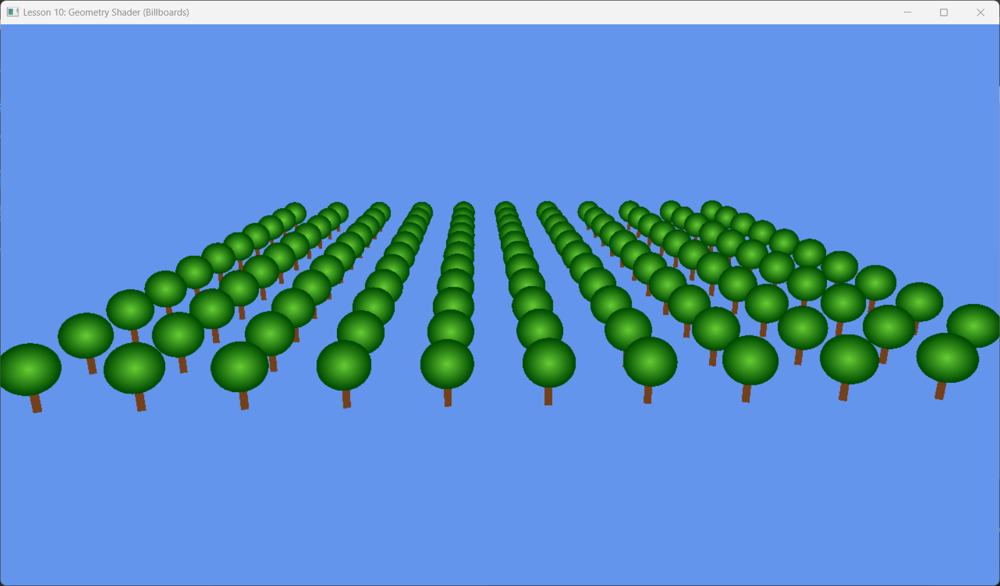

# Lesson 10: Geometry Shader Billboards (几何着色器)


*Source: LearnOpenGL.com*
*(图示：GS 可以将点扩展为房子)*

## 1. Introduction (简介)

到目前为止，我们只使用了 Vertex Shader (VS) 和 Pixel Shader (PS)。
在 VS 和 PS 之间，其实还有一个可选的、强大的阶段：**Geometry Shader (GS, 几何着色器)**。

*   **VS**: 1 输入 -> 1 输出 (顶点变换)。无法创建或销毁顶点。
*   **GS**: 1 图元输入 -> N 图元输出 (几何扩充)。
    *   可以输入一个点，输出两个三角形（Quad）。
    *   可以输入一个三角形，不输出任何东西（剔除）。

本节我们将利用 GS 实现 **Billboards (公告板)** 技术。
我们只向 GPU 发送数个“点”（树根的位置），让 GS 自动将其扩展为“总是面朝摄像机的四边形”（树的贴图）。这样可以极大地节省带宽。


---

## 2. Core Logic (核心逻辑)

### 2. Billboard Calculation (公告板计算)
为了让一张 2D 图片在 3D 空间中看起来总是立着的且面向观察者，我们需要构建一个局部坐标系：
1.  **Center**: 点的位置。
2.  **Up**: 这里的树我们希望它是垂直生长的，所以 Up = (0, 1, 0)。
3.  **Look**: 从 Center 指向 Camera。
4.  **Right**: Up 和 Look 的叉积 (Cross Product)。这决定了四边形的宽度方向。

有了 `Up` 和 `Right` 向量以及 `Size`，我们就可以算出四边形四个角的坐标：
$$ Corner = Center \pm (Right \times HalfWidth \pm Up \times HalfHeight) $$

---

## 3. Code Implementation (代码实现)

### 3.1 HLSL Geometry Shader
GS 的语法比较特殊。

```hlsl
struct GSOutput
{
    float4 PosH : SV_POSITION;
    float3 PosW : POSITION;
    float3 NormalW : NORMAL;
    float2 TexC : TEXCOORD;
    uint PrimID : SV_PrimitiveID;
};

// [maxvertexcount(N)]: 声明此 GS 最多输出 N 个顶点
[maxvertexcount(4)] 
void GS(point VertexOut gin[1], // 输入：点列表 (数组大小为1)
        inout TriangleStream<GSOutput> triStream) // 输出：三角形流
{
    // 1. 计算基向量
    float3 up = float3(0.0f, 1.0f, 0.0f);
    float3 look = gEyePosW - gin[0].PosW;
    look.y = 0.0f; // 保持由 y 轴约束 (树干直立)
    look = normalize(look);
    float3 right = cross(up, look);

    // 2. 计算半宽高
    float halfWidth = 0.5f * gin[0].Size.x;
    float halfHeight = 0.5f * gin[0].Size.y;

    float4 v[4];
    // 3. 构建四个顶点 (在世界空间)
    float3 center = gin[0].PosW;
    v[0] = float4(center + halfWidth*right - halfHeight*up, 1.0f); // Bottom-Left
    v[1] = float4(center + halfWidth*right + halfHeight*up, 1.0f); // Top-Left
    v[2] = float4(center - halfWidth*right - halfHeight*up, 1.0f); // Bottom-Right
    v[3] = float4(center - halfWidth*right + halfHeight*up, 1.0f); // Top-Right

    // 4. Transform to Homogenous Clip Space & Output
    GSOutput gout;
    // 对应的纹理坐标 (Quad UV)
    float2 texC[4] = { float2(0,1), float2(0,0), float2(1,1), float2(1,0) };
    
    [unroll]
    for(int i=0; i<4; ++i)
    {
        gout.PosH = mul(v[i], gViewProj);
        gout.PosW = v[i].xyz;
        gout.NormalW = look; // 法线面向摄像机
        gout.TexC = texC[i];
        gout.PrimID = primID;
        
        triStream.Append(gout); // 发射顶点
    }
}
```

### 3.2 C++ Pipeline Setup
在 C++ 端，我们需要做两件事：
1.  **Topology**: 告诉管线输入的是“点 (Point List)”，而不是“三角形”。
2.  **Link GS**: 将编译好的 GS 字节码绑给 PSO。

```cpp
void BuildPSO() {
    D3D12_GRAPHICS_PIPELINE_STATE_DESC psoDesc = ...;
    
    // Binding GS
    psoDesc.GS = { 
        reinterpret_cast<BYTE*>(m_gsByteCode->GetBufferPointer()), 
        m_gsByteCode->GetBufferSize() 
    };

    // **Important**: Topology Type must be POINT
    psoDesc.PrimitiveTopologyType = D3D12_PRIMITIVE_TOPOLOGY_TYPE_POINT;
    
    // ...
}

void OnRender() {
    // ...
    // Input Assembler 也要设为 PointList
    m_commandList->IASetPrimitiveTopology(D3D_PRIMITIVE_TOPOLOGY_POINTLIST);
    
    // 绘制 N 个点 (而不是 Indices 或 Triangles)
    m_commandList->DrawInstanced(m_treeCount, 1, 0, 0);
}
```

---

## 4. Summary (总结)

通过 Geometry Shader，我们成功实现了**几何放大 (Geometry Amplification)**。
*   **输入**: 简单的点云 (位置 + 大小)。
*   **输出**: 复杂的面向摄像机的四边形面片。

这种技术广泛用于粒子系统（雨、雪、火花）、植被渲染（草丛、树木 Imposter）以及线宽模拟等。

下一节课：**Compute Shader (计算着色器)** - 超越图形管线的并行计算能力。
