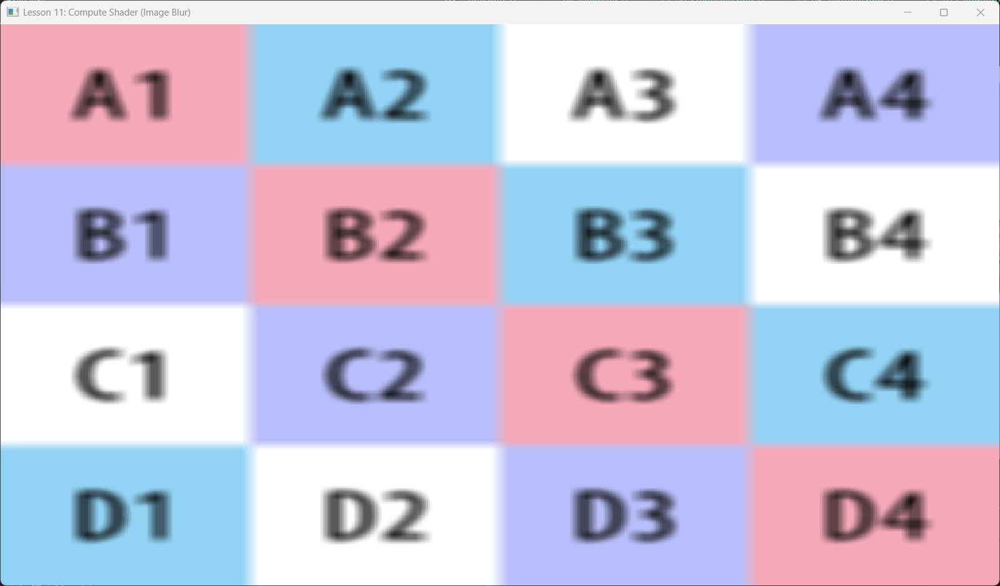

# Lesson 11: Compute Shader (GPGPU) (计算着色器)




## 1. Introduction (简介)

在传统的图形管线中，我们总是受限于“输入顶点 -> 光栅化 -> 像素着色”的流程。但 GPU 本质上是一个拥有成千上万个核心的巨型并行处理器。

**Compute Shader (CS)** 允许我们直接访问 GPU 的计算能力，而不需要经过光栅化等图形阶段。这就是所谓的 **GPGPU (General-Purpose computing on Graphics Processing Units)**。

本节我们将使用 CS 来进行图像后期处理（Post-Processing）。我们将读取一张图片，对其进行处理（比如模糊），并将结果写入另一张纹理，最后显示出来。

---

## 2. Core Concepts (核心概念)

### 2.1 Threads & Groups (线程与组)
Compute Shader 的执行单位是 **Thread (线程)**。
我们将线程组织成 **Thread Group (线程组)**。

*   **numthreads(x, y, z)**: 在 HLSL 中定义每个组里有多少个线程（例如 16x16x1 = 256个线程）。
*   **Dispatch(x, y, z)**: 在 C++ 中定义我们要启动多少个组。

总线程数 = (GroupX * ThreadX, GroupY * ThreadY, GroupZ * ThreadZ)。

### 2.2 UAV (Unordered Access View)
普通的纹理视图 (SRV) 是**只读**的。
为了让 Compute Shader 能写入纹理，我们需要一种新的视图：**UAV (无序访问视图)**。
之所以叫“无序”，是因为多个线程可能同时运行，谁先写谁后写是不确定的（除非使用内存屏障）。

---

## 3. Code Implementation (代码实现)

### 3.1 HLSL Compute Shader
这是一个最简单的图像拷贝/处理 Shader。

```hlsl
// 定义输入 (SRV) 和输出 (UAV)
Texture2D gInput : register(t0);
RWTexture2D<float4> gOutput : register(u0);

// 定义每个组的大小 (16x16)
[numthreads(16, 16, 1)]
void CS(uint3 dispatchThreadID : SV_DispatchThreadID)
{
    // dispatchThreadID 是全局唯一的线程 ID，对应像素坐标 (x, y)
    
    // 1. 读取输入像素
    float4 c = gInput[dispatchThreadID.xy];
    
    // 2. 这里可以做很多操作
    // 例如：Invert Color
    // c.rgb = 1.0f - c.rgb;
    
    // 例如：简单模糊 (实际上应该用 Shared Memory 优化)
    // ...
    
    // 3. 写入输出纹理
    gOutput[dispatchThreadID.xy] = c;
}
```

### 3.2 C++ Resource Setup
创建输出纹理时，必须允许 UAV。

```cpp
D3D12_RESOURCE_DESC texDesc = ...;
texDesc.Flags = D3D12_RESOURCE_FLAG_ALLOW_UNORDERED_ACCESS; // 关键

// 创建资源
m_d3dDevice->CreateCommittedResource(..., &texDesc, ...);

// 创建 SRV (供 Graphics 读取)
m_d3dDevice->CreateShaderResourceView(...);
// 创建 UAV (供 Compute 写入)
m_d3dDevice->CreateUnorderedAccessView(...);
```

### 3.3 Dispatch Loop (调度循环)
Compute Shader 的执行通常伴随着资源屏障。

```cpp
void OnRender() {
    // Phase 1: Compute (GPGPU Image Processing)
    // ------------------------------------------------
    m_commandList->SetPipelineState(m_psoCompute.Get());
    m_commandList->SetComputeRootSignature(m_rootSignatureCompute.Get());
    m_commandList->SetComputeRootDescriptorTable(0, ...); // Bind SRV(t0) and UAV(u0)

    // 计算需要多少个组才能覆盖整个图片
    // 假设图片 800x600，组大小 16x16 -> 需要 50x38 个组
    UINT numGroupsX = (UINT)ceilf(m_texWidth / 16.0f);
    UINT numGroupsY = (UINT)ceilf(m_texHeight / 16.0f);
    m_commandList->Dispatch(numGroupsX, numGroupsY, 1);

    // BARRIER: 等待 CS 写完 Output Texture
    auto barrier = CD3DX12_RESOURCE_BARRIER::Transition(
        m_textureOutput.Get(),
        D3D12_RESOURCE_STATE_UNORDERED_ACCESS, // CS 写状态
        D3D12_RESOURCE_STATE_PIXEL_SHADER_RESOURCE // PS 读状态
    );
    m_commandList->ResourceBarrier(1, &barrier);


    // Phase 2: Graphics (Display Result)
    // ------------------------------------------------
    // 绘制一个全屏四边形，采样 m_textureOutput 显示到屏幕上
    m_commandList->SetPipelineState(m_psoGraphics.Get());
    // ... DrawQuad ...
    
    // Reset Barrier for next frame (back to UAV)
    auto barrierReset = CD3DX12_RESOURCE_BARRIER::Transition(
        m_textureOutput.Get(),
        D3D12_RESOURCE_STATE_PIXEL_SHADER_RESOURCE,
        D3D12_RESOURCE_STATE_UNORDERED_ACCESS
    );
    m_commandList->ResourceBarrier(1, &barrierReset);
}
```

---

## 4. Summary (总结)

Compute Shader 解锁了 GPU 的通用计算能力。除了图像处理，它还用于：
*   **物理模拟**: 粒子系统计算位置更新。
*   **剔除 (Culling)**: 在 GPU 上剔除不可见物体，生成 DrawIndirectBuffer。
*   **光线追踪**: 在 DXR 出现之前，很多人用 CS 写光追。

下一节课：**Tessellation (曲面细分)**。
