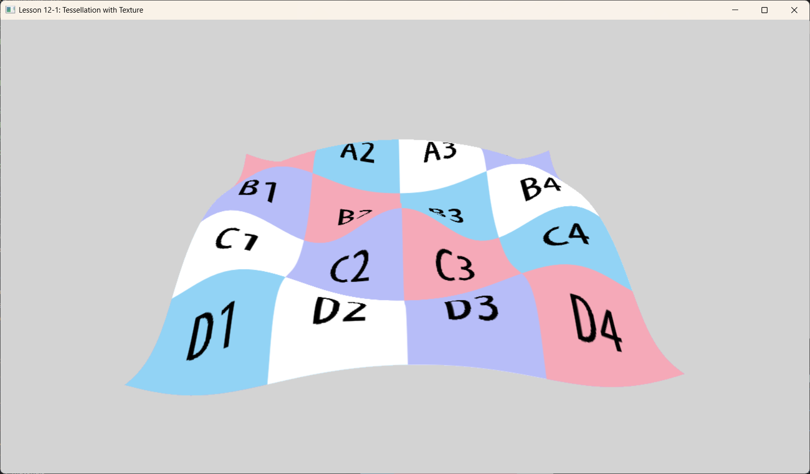

# Lesson 12-1: Tessellation & Textured Terrain (曲面细分与纹理地形)



## 1. Introduction (概述)

本课程演示了 **曲面细分 (Tessellation)** 与 **程序化几何 (Procedural Geometry)** 和 **纹理 (Texturing)** 的结合。
与标准的网格渲染（几何体固定）不同，本课程使用 GPU 曲面细分器将粗糙的四边形细分为高密度的网格。然后，在域着色器 (Domain Shader, DS) 中通过程序化方式修改网格高度以创建波浪，并应用纹理以增加表面细节。

## 2. Core Concepts (核心概念)

### 2.1 Tessellation Pipeline (曲面细分管线)
曲面细分阶段允许我们动态生成几何体。
1.  **Vertex Shader (VS, 顶点着色器)**: 将控制点（四边形的角点）传递给外壳着色器。
2.  **Hull Shader (HS, 外壳着色器)**:
    -   **Constant HS**: 计算细分因子（细分程度）。在本课中，我们使用静态因子 64.0 来获得高细节。
    -   **Control Point HS**: 将控制点传递给域着色器。
    -   **Tessellator**: 固定功能硬件，根据因子细分域（四边形）。
3.  **Domain Shader (DS, 域着色器)**: 为每个生成的顶点调用。这是几何形状成型的地方。

### 2.2 Procedural Displacement (程序化置换)
本课程不是读取高度图纹理（地形渲染中常见做法），而是通过解析几何计算高度。
-   来自细分器的 UV 坐标用于插值 Patch 位置。
-   数学函数（余弦波）决定 Y 坐标。
-   由于我们有高细分密度，波浪看起来很平滑。

### 2.3 Texturing (纹理)
在像素着色器中应用标准的漫反射纹理。UV 坐标在细分网格上插值，确保纹理正确映射到变形的几何体上。

## 3. Code Analysis (代码分析)

### 3.1 Shader Logic (着色器逻辑 - `src/shaders.hlsl`)

**Hull Shader (Determination of Detail):**
```hlsl
PatchTess ConstantHS(InputPatch<VertexOut, 4> patch, uint patchID : SV_PrimitiveID)
{
    PatchTess pt;
    float tess = 64.0f; // 高静态细分因子以获得平滑度
    pt.EdgeTess[0] = tess; // ... 所有边
    pt.InsideTess[0] = tess; // ... 内部
    return pt;
}
```

**Domain Shader (Shape Generation):**
域着色器充当细分顶点的“顶点着色器”。
```hlsl
[domain("quad")]
DomainOut DS(PatchTess patchTess, float2 uv : SV_DomainLocation, const OutputPatch<HullOut, 4> quad)
{
    // 1. 使用 UV 在平面四边形上插值位置
    float3 v1 = lerp(quad[0].PosL, quad[1].PosL, uv.x); 
    float3 v2 = lerp(quad[2].PosL, quad[3].PosL, uv.x); 
    float3 p  = lerp(v1, v2, uv.y); 
    
    // 2. 应用程序化置换 (余弦波)
    // 注意: 这里我们没有采样高度图，而是用数学计算高度。
    float r = sqrt(p.x*p.x + p.z*p.z);
    p.y = 1.5f * (cos(r * 0.5f)); 

    // 3. 投影到裁剪空间
    dout.PosH = mul(float4(p, 1.0f), gWorldViewProj);
    dout.TexC = tex; // 传递插值后的 UV
    return dout;
}
```

**Pixel Shader:**
简单地采样纹理。
```hlsl
float4 PS(DomainOut pin) : SV_Target
{
    return gDiffuseMap.Sample(gsamLinear, pin.TexC);
}
```

## 4. Application (应用程序 - `src/main.cpp`)
-   加载本地纹理（例如 `bricks.dds` 或类似）。
-   将图元拓扑设置为 `D3D_PRIMITIVE_TOPOLOGY_4_CONTROL_POINT_PATCHLIST`。
-   绘制一个简单的 Quad（4 个顶点）。曲面细分器将其扩展为数千个三角形。

## 5. Summary (总结)
这一课是地形引擎的基础。虽然这个特定的例子使用 **程序化数学函数** 来计算高度，但只需将 `p.y` 计算替换为 `gHeightMap.Sample(...)` 调用，即可实现完整的 **基于纹理的置换贴图 (Texture-Based Displacement Mapping)**。
