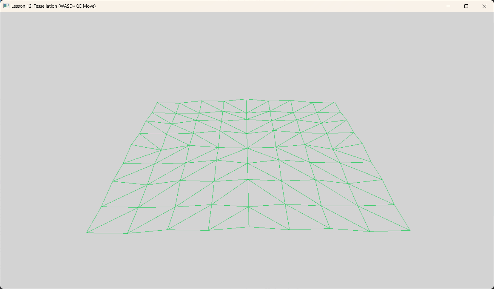

# Lesson 12: Tessellation (曲面细分)




## 1. Introduction (简介)

**Tessellation (曲面细分)** 是 DirectX 11 引入的一项重大功能。它允许我们将一个低精度的多边形（Patch）在 GPU 上动态地“裂变”成成百上千个小三角形。

**Why?**
1.  **LOD (Level of Detail)**: 离摄像机近的地方细分多，远的细分少。
2.  **Displacement Mapping (置换贴图)**: 真正的几何凹凸，而不仅仅是法线贴图的光影欺骗。
3.  **节省带宽**: 只需要从 CPU 传输少量控制点，海量顶点在 GPU 内部生成。

本节我们将实现一个最基础的细分案例：将一个 Quad（4个控制点）细分成网格，并以线框模式（Wireframe）显示出来。

---

## 2. The Pipeline Stages (管线阶段)

启用细分后，管线新增了三个阶段：

1.  **Hull Shader (HS, 壳着色器)**: 可编程。
    *   决定**细分因子 (Tessellation Factors)**（比如：这条边切 10 刀，内部切 10X10）。
    *   处理控制点 (Control Points)。
2.  **Tessellator (镶嵌器)**: 固定功能 (Fixed Function)。
    *   根据 HS 给出的因子，傻瓜式地生成一堆基于 $(u,v)$ 坐标的顶点和索引。
3.  **Domain Shader (DS, 域着色器)**: 可编程。
    *   接收 Tessellator 生成的 $(u,v)$ 坐标。
    *   对控制点进行插值（如双线性插值），计算出生成的顶点的实际 World Position。
    *   这相当于细分后的“Vertex Shader”。

---

## 3. Code Implementation (代码实现)

### 3.1 Hull Shader (HS)
HS 主要负责告诉 GPU “怎么切”。

```hlsl
// Patch Constant Function
// 计算细分因子的核心函数
struct PatchTess
{
    float EdgeTess[4] : SV_TessFactor; // 四条边的细分等级
    float InsideTess[2] : SV_InsideTessFactor; // 内部水平/垂直细分等级
};

PatchTess ConstantHS(InputPatch<VertexOut, 4> patch, uint patchID : SV_PrimitiveID)
{
    PatchTess pt;
    // 示例：写死为 25.0。意味着每条边被切成 25 段。
    // 在实际应用中，这里会计算：距离 < 10米 ? 64.0 : 2.0;
    pt.EdgeTess[0] = 25.0f; 
    pt.EdgeTess[1] = 25.0f;
    pt.EdgeTess[2] = 25.0f; 
    pt.EdgeTess[3] = 25.0f;
    pt.InsideTess[0] = 25.0f;
    pt.InsideTess[1] = 25.0f;
    return pt;
}

// Control Point HS
[domain("quad")] // 地形/墙面常用 Quad，球体常用 Tri
[partitioning("integer")]
[outputtopology("triangle_cw")]
[outputcontrolpoints(4)]
[patchconstantfunc("ConstantHS")]
HullOut HS(InputPatch<VertexOut, 4> p, uint i : SV_OutputControlPointID)
{
    HullOut hout;
    hout.PosL = p[i].PosL; // 直接透传控制点坐标
    return hout;
}
```

### 3.2 Domain Shader (DS)
DS 负责根据重心坐标算出最终顶点位置。

```hlsl
[domain("quad")]
DomainOut DS(PatchTess patchTess, float2 uv : SV_DomainLocation, const OutputPatch<HullOut, 4> quad)
{
    DomainOut dout;
    
    // Bilinear Interpolation (双线性插值)
    // 根据 uv 坐标（0~1），在 4 个控制点之间插值
    float3 v1 = lerp(quad[0].PosL, quad[1].PosL, uv.x); // Top Edge
    float3 v2 = lerp(quad[2].PosL, quad[3].PosL, uv.x); // Bottom Edge
    float3 p  = lerp(v1, v2, uv.y); 

    // 如果有高度图 (Heightmap)，在这里采样并偏移 p.y
    // p.y += gHeightMap.SampleLevel(..., uv, 0).r * scale;

    // 变换到裁剪空间
    dout.PosH = mul(float4(p, 1.0f), gWorldViewProj);
    
    return dout;
}
```

### 3.3 C++ Setup
```cpp
void BuildPSO() {
    D3D12_GRAPHICS_PIPELINE_STATE_DESC psoDesc = {};
    
    // Bind HS & DS
    psoDesc.HS = { ... m_hsByteCode ... };
    psoDesc.DS = { ... m_dsByteCode ... };
    
    // Topology Type must be PATCH
    psoDesc.PrimitiveTopologyType = D3D12_PRIMITIVE_TOPOLOGY_TYPE_PATCH;
    
    // For demo visualization, use Wireframe
    psoDesc.RasterizerState.FillMode = D3D12_FILL_MODE_WIREFRAME;
}

void OnRender() {
    // Input Assembler 必须设置为 PATCH LIST (Control point count = 4)
    m_commandList->IASetPrimitiveTopology(D3D_PRIMITIVE_TOPOLOGY_4_CONTROL_POINT_PATCHLIST);
    
    // Draw 4 vertices (1 patch)
    m_commandList->DrawInstanced(4, 1, 0, 0); 
}
```

---

## 4. Summary (总结)

至此，基础教程部分结束。我们已经完整走过了 DirectX 12 渲染管线的每一个可编程阶段：
**VS -> HS -> DS -> GS -> PS** (以及独立的 **CS**)。

接下来的 **Lesson 12-1** 将结合 Tessellation 和 Texture，实现真正的 **Terrain Rendering (地形渲染)**。

