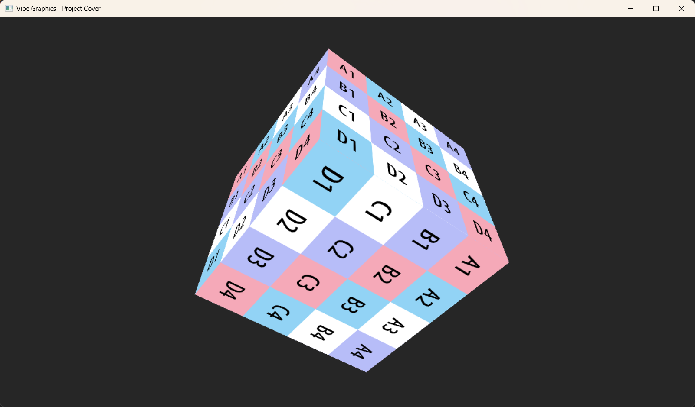

# VibeDX12Renderer Tutorials

## Introduction (简介)
Welcome to the **VibeDX12Renderer** learning journey. This project is a comprehensive guide to understanding and implementing a rendering engine using **DirectX 12**. From the basic initialization of a window to advanced techniques like Tessellation and Compute Shaders, these lessons provide a step-by-step pathway to mastering modern graphics programming.

欢迎踏上 **VibeDX12Renderer** 的学习之旅。本项目是一份关于理解和实现 **DirectX 12** 渲染引擎的综合指南。从初始化窗口的基础知识到曲面细分和计算着色器等高级技术，这些课程为您掌握现代图形编程提供了一条循序渐进的道路。

## Table of Contents (目录)
1. [Hello Window (窗口初始化)](01_HelloWindow.md)
2. [Init DX12 (DX12初始化)](02_InitDX12.md)
3. [Hello Triangle (三角形绘制)](03_HelloTriangle.md)
4. [Depth Buffering (深度缓冲)](04_DepthBuffering.md)
5. [Textures (纹理)](05_Textures.md)
    - [Loading (加载)](05-1_Textures_Load.md)
6. [Camera Control (摄像机控制)](06_CameraControl.md)
7. [Basic Lighting (基础光照)](07_Lighting.md)
    - [Materials (材质)](07-1_Materials.md)
    - [Textured Lighting (纹理光照)](07-2_TexturedLighting.md)
8. [Blending (混合)](08_Blending.md)
9. [Stenciling (模板测试)](09_Stenciling.md)
10. [Geometry Shader (几何着色器)](10_GeometryShader.md)
11. [Compute Shader (计算着色器)](11_ComputeShader.md)
12. [Tessellation (曲面细分)](12_Tessellation.md)
    - [Textured Terrain (纹理地形)](12-1_Tessellation_TexturedTerrain.md)

---

## About This Tutorial (关于本教程)
This tutorial series was collaboratively generated by the user and **GitHub Copilot**, an AI programming assistant.
The code, documentation, and asset integration illustrate the power of AI-assisted development in tackling complex Computer Graphics concepts.

本教程系列由用户与 **GitHub Copilot**（AI 编程助手）合作生成。
代码、文档和资产集成展示了 AI 辅助开发在解决复杂计算机图形学概念方面的强大能力。

---
